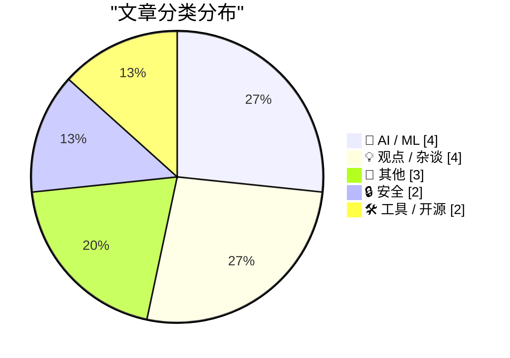
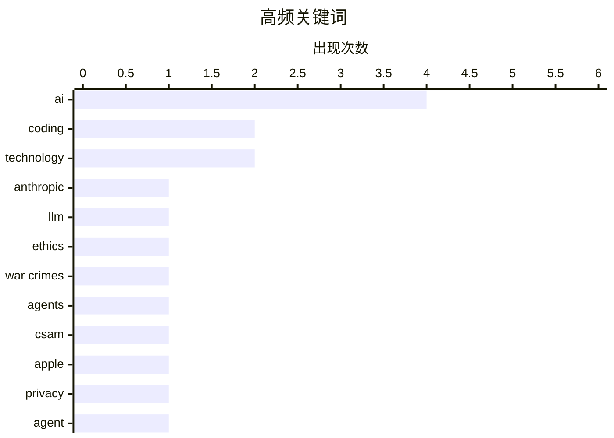

# 📰 AI 博客每日精选 — 2026-02-28

> 来自 Karpathy 推荐的 92 个顶级技术博客，AI 精选 Top 15

## 📝 今日看点

今日技术圈主要关注AI代码编写技术的快速发展和企业在市场压力下的调整策略。安索普公司拒绝为战争犯罪提供支持，凸显了科技公司在伦理和法律问题上的立场。同时，Block公司大规模裁员反映了科技行业在面对市场挑战时的应对措施。

---

## 🏆 今日必读

🥇 **安索普公司拒绝为战争犯罪提供支持**

[A Cookie for Dario? — Anthropic and selling death](https://anildash.com/2026/02/27/a-cookie-for-dario/) — anildash.com · 8 小时前 · 🤖 AI / ML

> 文章讨论了安索普公司（Claude的开发者）拒绝为国防部长彼得·赫格塞斯修改其平台，以支持战争犯罪的请求。安索普公司CEO达里奥·阿莫迪拒绝了这一要求，尽管政府声称是为了“合法用途”。安索普公司的拒绝表明了其在伦理和法律问题上的立场。安索普公司的行为体现了对技术伦理的坚持，拒绝将其技术用于非法目的。

💡 **为什么值得读**: 这篇文章值得读，因为它揭示了大型科技公司在面对政府压力时如何坚持技术伦理，值得关注和借鉴。

🏷️ Anthropic, LLM, ethics, war crimes

🥈 **AI代码编写的详细尝试**

[An AI agent coding skeptic tries AI agent coding, in excessive detail](https://simonwillison.net/2026/Feb/27/ai-agent-coding-in-excessive-detail/#atom-everything) — simonwillison.net · 12 小时前 · 🤖 AI / ML

> 文章介绍了Max Woolf对AI代码编写的详细尝试，从简单的YouTube元数据抓取到更复杂的项目。他通过一系列项目展示了AI代码编写的进展和潜力。Max Woolf的尝试表明，AI代码编写技术已经取得了显著进步，能够处理复杂的编程任务。AI代码编写技术的发展将极大地提升开发效率，减少人工干预。

💡 **为什么值得读**: 这篇文章值得读，因为它提供了AI代码编写技术的实际应用案例，展示了其在提升开发效率方面的巨大潜力。

🏷️ AI, coding, agents

🥉 **西弗吉尼亚州反苹果CSAM诉讼将帮助儿童猎人逃脱法律制裁**

[West Virginia’s Anti-Apple CSAM Lawsuit Would Help Child Predators Walk Free](https://www.techdirt.com/2026/02/25/west-virginias-anti-apple-csam-lawsuit-would-help-child-predators-walk-free/) — daringfireball.net · 13 小时前 · 🔒 安全

> 文章讨论了西弗吉尼亚州对苹果的CSAM（儿童色情内容）诉讼，指出如果苹果被迫扫描iCloud，将导致证据被法庭排除。这种强制扫描将违反第四修正案，使得证据无法被法庭采纳。苹果的扫描行为将被视为无证搜查，导致儿童猎人逃脱法律制裁。作者强调，这种诉讼将对儿童保护产生负面影响。

💡 **为什么值得读**: 这篇文章值得读，因为它揭示了强制扫描技术对法律和儿童保护的潜在负面影响，值得关注和讨论。

🏷️ CSAM, Apple, privacy

---

## 📊 数据概览

| 扫描源 | 抓取文章 | 时间范围 | 精选 |
|:---:|:---:|:---:|:---:|
| 88/92 | 2369 篇 → 23 篇 | 24h | **15 篇** |

### 分类分布



### 高频关键词



<details>
<summary>📈 纯文本关键词图（终端友好）</summary>

```
ai         │ ████████████████████ 4
coding     │ ██████████░░░░░░░░░░ 2
technology │ ██████████░░░░░░░░░░ 2
anthropic  │ █████░░░░░░░░░░░░░░░ 1
llm        │ █████░░░░░░░░░░░░░░░ 1
ethics     │ █████░░░░░░░░░░░░░░░ 1
war crimes │ █████░░░░░░░░░░░░░░░ 1
agents     │ █████░░░░░░░░░░░░░░░ 1
csam       │ █████░░░░░░░░░░░░░░░ 1
apple      │ █████░░░░░░░░░░░░░░░ 1
```

</details>

### 🏷️ 话题标签

**ai**(4) · **coding**(2) · **technology**(2) · anthropic(1) · llm(1) · ethics(1) · war crimes(1) · agents(1) · csam(1) · apple(1) · privacy(1) · agent(1) · passkeys(1) · encryption(1) · user data(1) · block(1) · layoffs(1) · tech industry(1) · openai(1) · financing(1)

---

## 🤖 AI / ML

### 1. 安索普公司拒绝为战争犯罪提供支持

[A Cookie for Dario? — Anthropic and selling death](https://anildash.com/2026/02/27/a-cookie-for-dario/) — **anildash.com** · 8 小时前 · ⭐ 27/30

> 文章讨论了安索普公司（Claude的开发者）拒绝为国防部长彼得·赫格塞斯修改其平台，以支持战争犯罪的请求。安索普公司CEO达里奥·阿莫迪拒绝了这一要求，尽管政府声称是为了“合法用途”。安索普公司的拒绝表明了其在伦理和法律问题上的立场。安索普公司的行为体现了对技术伦理的坚持，拒绝将其技术用于非法目的。

🏷️ Anthropic, LLM, ethics, war crimes

---

### 2. AI代码编写的详细尝试

[An AI agent coding skeptic tries AI agent coding, in excessive detail](https://simonwillison.net/2026/Feb/27/ai-agent-coding-in-excessive-detail/#atom-everything) — **simonwillison.net** · 12 小时前 · ⭐ 24/30

> 文章介绍了Max Woolf对AI代码编写的详细尝试，从简单的YouTube元数据抓取到更复杂的项目。他通过一系列项目展示了AI代码编写的进展和潜力。Max Woolf的尝试表明，AI代码编写技术已经取得了显著进步，能够处理复杂的编程任务。AI代码编写技术的发展将极大地提升开发效率，减少人工干预。

🏷️ AI, coding, agents

---

### 3. AI代码编写的详细尝试

[An AI agent coding skeptic tries AI agent coding, in excessive detail](https://minimaxir.com/2026/02/ai-agent-coding/) — **minimaxir.com** · 14 小时前 · ⭐ 23/30

> 文章介绍了Max Woolf对AI代码编写的详细尝试，从简单的YouTube元数据抓取到更复杂的项目。他通过一系列项目展示了AI代码编写的进展和潜力。Max Woolf的尝试表明，AI代码编写技术已经取得了显著进步，能够处理复杂的编程任务。AI代码编写技术的发展将极大地提升开发效率，减少人工干预。

🏷️ AI, coding, agent

---

### 4. OpenAI的新融资是否合理？

[Does OpenAI’s new financing make sense?](https://garymarcus.substack.com/p/does-openais-new-financing-make-sense) — **garymarcus.substack.com** · 12 小时前 · ⭐ 21/30

> 文章质疑OpenAI的新融资是否合理，指出存在严重的疑虑。作者认为，OpenAI的融资策略可能存在风险，需要进一步评估。OpenAI的融资策略将影响其未来的发展和市场地位。作者建议对OpenAI的融资策略进行更深入的分析。

🏷️ OpenAI, financing, AI

---

## 💡 观点 / 杂谈

### 5. Block裁员4000人，占员工总数的一半

[Block Lays Off 4,000 (of 10,000) Employees](https://www.cnbc.com/2026/02/26/block-laying-off-about-4000-employees-nearly-half-of-its-workforce.html) — **daringfireball.net** · 17 小时前 · ⭐ 21/30

> Block公司宣布裁员4000人，占员工总数的一半，从10000人减少到6000人。裁员后，股价在延长交易中上涨了24%。Block公司的裁员决定反映了公司在面对市场压力时的调整策略。裁员将帮助公司降低成本，提高运营效率。

🏷️ Block, layoffs, tech industry

---

### 6. TUDUMB

[TUDUMB](https://spyglass.org/netflix-warner-bros-paramount-deal/) — **daringfireball.net** · 16 小时前 · ⭐ 18/30

> 文章讨论了Netflix与华纳兄弟探索公司的交易，指出Netflix有能力承担这一成本。Netflix的市值为4000亿美元，远高于华纳兄弟探索公司的110亿美元。Netflix的交易策略反映了其在市场中的强大竞争力和财务实力。作者认为，Netflix的交易将对市场产生深远影响。

🏷️ Netflix, acquisition, media

---

### 7. Computers and the Internet: A Two-Edged Sword

[Computers and the Internet: A Two-Edged Sword](https://blog.jim-nielsen.com/2026/two-edged-sword-of-computers-and-internet/) — **blog.jim-nielsen.com** · 13 小时前 · ⭐ 18/30

> <p>Dave Rupert articulated something in <a href="https://daverupert.com/2026/02/computers-were-a-mistake-for-me/" >“Priority of idle hands”</a> that’s been growing in my subconscious for years:</p>
<b

🏷️ computers, internet, technology, impact

---

### 8. Did Trump just overplay his hand?

[Did Trump just overplay his hand?](https://garymarcus.substack.com/p/did-trump-just-overplay-his-hand) — **garymarcus.substack.com** · 9 小时前 · ⭐ 16/30

> We will learn a lot about Silicon Valley in the upcoming days

🏷️ Silicon Valley, politics, technology

---

## 📝 其他

### 9. Unicode Explorer using binary search over fetch() HTTP range requests

[Unicode Explorer using binary search over fetch() HTTP range requests](https://simonwillison.net/2026/Feb/27/unicode-explorer/#atom-everything) — **simonwillison.net** · 15 小时前 · ⭐ 17/30

> <p><strong><a href="https://tools.simonwillison.net/unicode-binary-search">Unicode Explorer using binary search over fetch() HTTP range requests</a></strong></p>
Here's a little prototype I built this

🏷️ Unicode, HTTP, binary search

---

### 10. How to Block the ‘Upgrade to Tahoe’ Alerts and System Settings Indicator

[How to Block the ‘Upgrade to Tahoe’ Alerts and System Settings Indicator](https://robservatory.com/block-the-upgrade-to-tahoe-alerts-and-system-settings-indicator/) — **daringfireball.net** · 14 小时前 · ⭐ 15/30

> Rob Griffiths, writing at The Robservatory:


  So I have macOS Tahoe on my laptop, but I’m keeping my desktop
Mac on macOS Sequoia for now. Which means I have the joy of
seeing things like this wonde

🏷️ macOS, upgrades, notifications

---

### 11. ★ A Sometimes-Hidden Setting Controls What Happens When You Tap a Call in the iOS 26 Phone App

[★ A Sometimes-Hidden Setting Controls What Happens When You Tap a Call in the iOS 26 Phone App](https://daringfireball.net/2026/02/sometimes_hidden_setting_phone_app) — **daringfireball.net** · 14 小时前 · ⭐ 15/30

> Apple’s solution to this dilemma — to show the “Tap Recents to Call” in Settings if, and only if, Unified is the current view option in the Phone app — is lazy. And as a result, it’s quite confusing.

🏷️ iOS, Phone app, settings

---

## 🔒 安全

### 12. 西弗吉尼亚州反苹果CSAM诉讼将帮助儿童猎人逃脱法律制裁

[West Virginia’s Anti-Apple CSAM Lawsuit Would Help Child Predators Walk Free](https://www.techdirt.com/2026/02/25/west-virginias-anti-apple-csam-lawsuit-would-help-child-predators-walk-free/) — **daringfireball.net** · 13 小时前 · ⭐ 24/30

> 文章讨论了西弗吉尼亚州对苹果的CSAM（儿童色情内容）诉讼，指出如果苹果被迫扫描iCloud，将导致证据被法庭排除。这种强制扫描将违反第四修正案，使得证据无法被法庭采纳。苹果的扫描行为将被视为无证搜查，导致儿童猎人逃脱法律制裁。作者强调，这种诉讼将对儿童保护产生负面影响。

🏷️ CSAM, Apple, privacy

---

### 13. 请不要使用密钥来加密用户数据

[Please, please, please stop using passkeys for encrypting user data](https://simonwillison.net/2026/Feb/27/passkeys/#atom-everything) — **simonwillison.net** · 10 小时前 · ⭐ 21/30

> 文章讨论了用户频繁丢失密钥，导致数据无法恢复的问题。Tim Cappalli强调，密钥不应用于加密用户数据，因为用户可能不理解数据一旦加密就无法恢复。密钥的丢失将导致数据永久丢失，影响用户体验。作者建议停止使用密钥来加密用户数据，以避免数据丢失的风险。

🏷️ passkeys, encryption, user data

---

## 🛠 工具 / 开源

### 14. 使用Frigate升级我的开源树莓派监控服务器

[Upgrading my Open Source Pi Surveillance Server with Frigate](https://www.jeffgeerling.com/blog/2026/upgrading-my-open-source-pi-surveillance-server-frigate/) — **jeffgeerling.com** · 17 小时前 · ⭐ 19/30

> 文章介绍了作者使用树莓派和Frigate构建的开源监控服务器，并进行了升级。作者使用Coral TPU进行物体检测，实现了本地监控，无需云集成。Frigate的升级提升了监控系统的性能和稳定性。作者强调，开源监控系统的优势在于数据的本地化处理，保护用户隐私。

🏷️ Frigate, surveillance, Raspberry Pi

---

### 15. 免费提供Claude Max给大型开源项目维护者

[Free Claude Max for (large project) open source maintainers](https://simonwillison.net/2026/Feb/27/claude-max-oss-six-months/#atom-everything) — **simonwillison.net** · 14 小时前 · ⭐ 18/30

> 安索普公司为大型开源项目维护者提供免费的Claude Max 20x计划，持续六个月。维护者需要满足GitHub星标数量或NPM下载量的条件。Claude Max的免费提供将帮助开源项目提升开发效率，促进技术创新。安索普公司的举措体现了对开源社区的支持和贡献。

🏷️ Claude, open source, AI

---

*生成于 2026-02-28 08:52 | 扫描 88 源 → 获取 2369 篇 → 精选 15 篇*
*基于 [Hacker News Popularity Contest 2025](https://refactoringenglish.com/tools/hn-popularity/) RSS 源列表，由 [Andrej Karpathy](https://x.com/karpathy) 推荐*
*由「懂点儿AI」制作，欢迎关注同名微信公众号获取更多 AI 实用技巧 💡*
