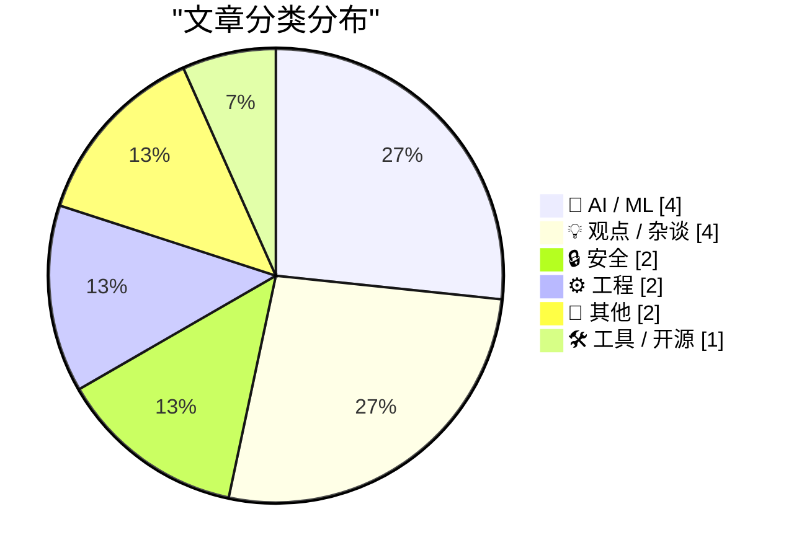
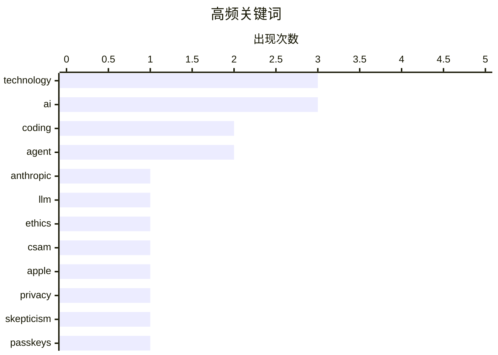

# 📰 AI 博客每日精选 — 2026-02-28

> 来自 Karpathy 推荐的 92 个顶级技术博客，AI 精选 Top 15

## 📝 今日看点

今日技术圈主要关注AI技术的应用与伦理问题，以及科技公司的重大战略调整。AI代码编写工具的实际应用和潜力成为热议话题，同时安索普公司拒绝支持战争犯罪的行为引发了广泛讨论。此外，科技巨头如Block和Netflix的裁员和收购动作，展示了行业内的激烈竞争与财务策略。

---

## 🏆 今日必读

🥇 **安索普公司拒绝支持战争犯罪**

[A Cookie for Dario? — Anthropic and selling death](https://anildash.com/2026/02/27/a-cookie-for-dario/) — anildash.com · 9 小时前 · 🤖 AI / ML

> 安索普公司（Claude平台的开发者）拒绝了国防部长Pete Hegseth要求修改其平台以支持战争犯罪的请求。安索普公司CEO Dario Amodei明确拒绝了这一要求。政府声称这是为了“合法用途”，但他们也将最近的犯罪行为描述为合法。安索普公司坚持其平台不应被用于非法目的。

💡 **为什么值得读**: 了解大型科技公司在伦理和法律问题上的立场，有助于更好地理解技术在社会中的角色和责任。

🏷️ Anthropic, LLM, ethics, technology

🥈 **AI代码编写的详细尝试**

[An AI agent coding skeptic tries AI agent coding, in excessive detail](https://simonwillison.net/2026/Feb/27/ai-agent-coding-in-excessive-detail/#atom-everything) — simonwillison.net · 12 小时前 · 🤖 AI / ML

> Max Woolf详细描述了他使用AI代码编写工具的经历，从简单的YouTube元数据抓取器开始，逐步演变为更复杂的项目。他展示了AI代码编写工具在实际应用中的潜力和局限。AI代码编写工具在编程任务中的表现令人印象深刻，但仍需进一步改进。

💡 **为什么值得读**: 通过具体案例了解AI代码编写工具的实际应用和潜力，有助于开发者更好地评估和使用这些工具。

🏷️ AI, coding, agent

🥉 **西弗吉尼亚州反苹果CSAM诉讼将帮助儿童猎人逃脱法律制裁**

[West Virginia’s Anti-Apple CSAM Lawsuit Would Help Child Predators Walk Free](https://www.techdirt.com/2026/02/25/west-virginias-anti-apple-csam-lawsuit-would-help-child-predators-walk-free/) — daringfireball.net · 13 小时前 · 🔒 安全

> 西弗吉尼亚州的反苹果CSAM诉讼要求苹果扫描iCloud中的CSAM内容，但这将导致证据被法院排除。第四修正案的排除规则意味着这些证据将被视为非法获取，无法用于起诉。这将使儿童猎人逃脱法律制裁。

💡 **为什么值得读**: 了解法律和技术在保护儿童方面的复杂关系，有助于更好地制定相关政策和技术措施。

🏷️ CSAM, Apple, privacy

---

## 📊 数据概览

| 扫描源 | 抓取文章 | 时间范围 | 精选 |
|:---:|:---:|:---:|:---:|
| 88/92 | 2369 篇 → 23 篇 | 24h | **15 篇** |

### 分类分布



### 高频关键词



<details>
<summary>📈 纯文本关键词图（终端友好）</summary>

```
technology │ ████████████████████ 3
ai         │ ████████████████████ 3
coding     │ █████████████░░░░░░░ 2
agent      │ █████████████░░░░░░░ 2
anthropic  │ ███████░░░░░░░░░░░░░ 1
llm        │ ███████░░░░░░░░░░░░░ 1
ethics     │ ███████░░░░░░░░░░░░░ 1
csam       │ ███████░░░░░░░░░░░░░ 1
apple      │ ███████░░░░░░░░░░░░░ 1
privacy    │ ███████░░░░░░░░░░░░░ 1
```

</details>

### 🏷️ 话题标签

**technology**(3) · **ai**(3) · **coding**(2) · agent(2) · anthropic(1) · llm(1) · ethics(1) · csam(1) · apple(1) · privacy(1) · skepticism(1) · passkeys(1) · encryption(1) · user data(1) · block(1) · layoffs(1) · tech industry(1) · openai(1) · financing(1) · claude(1)

---

## 🤖 AI / ML

### 1. 安索普公司拒绝支持战争犯罪

[A Cookie for Dario? — Anthropic and selling death](https://anildash.com/2026/02/27/a-cookie-for-dario/) — **anildash.com** · 9 小时前 · ⭐ 27/30

> 安索普公司（Claude平台的开发者）拒绝了国防部长Pete Hegseth要求修改其平台以支持战争犯罪的请求。安索普公司CEO Dario Amodei明确拒绝了这一要求。政府声称这是为了“合法用途”，但他们也将最近的犯罪行为描述为合法。安索普公司坚持其平台不应被用于非法目的。

🏷️ Anthropic, LLM, ethics, technology

---

### 2. AI代码编写的详细尝试

[An AI agent coding skeptic tries AI agent coding, in excessive detail](https://simonwillison.net/2026/Feb/27/ai-agent-coding-in-excessive-detail/#atom-everything) — **simonwillison.net** · 12 小时前 · ⭐ 26/30

> Max Woolf详细描述了他使用AI代码编写工具的经历，从简单的YouTube元数据抓取器开始，逐步演变为更复杂的项目。他展示了AI代码编写工具在实际应用中的潜力和局限。AI代码编写工具在编程任务中的表现令人印象深刻，但仍需进一步改进。

🏷️ AI, coding, agent

---

### 3. AI代码编写的详细尝试

[An AI agent coding skeptic tries AI agent coding, in excessive detail](https://minimaxir.com/2026/02/ai-agent-coding/) — **minimaxir.com** · 15 小时前 · ⭐ 24/30

> Max Woolf详细描述了他使用AI代码编写工具的经历，从简单的YouTube元数据抓取器开始，逐步演变为更复杂的项目。他展示了AI代码编写工具在实际应用中的潜力和局限。AI代码编写工具在编程任务中的表现令人印象深刻，但仍需进一步改进。

🏷️ AI, coding, agent, skepticism

---

### 4. OpenAI的新融资是否合理？

[Does OpenAI’s new financing make sense?](https://garymarcus.substack.com/p/does-openais-new-financing-make-sense) — **garymarcus.substack.com** · 12 小时前 · ⭐ 21/30

> Gary Marcus对OpenAI的新融资表示怀疑，认为其合理性值得商榷。OpenAI的新融资计划引发了广泛的质疑和讨论。

🏷️ OpenAI, financing, AI

---

## 💡 观点 / 杂谈

### 5. Block裁员4000人

[Block Lays Off 4,000 (of 10,000) Employees](https://www.cnbc.com/2026/02/26/block-laying-off-about-4000-employees-nearly-half-of-its-workforce.html) — **daringfireball.net** · 17 小时前 · ⭐ 21/30

> Block公司宣布裁员4000人，占其员工总数的一半。CEO Jack Dorsey在给股东的信中表示，公司将从10000人减少到6000人。股价在裁员消息发布后大幅上涨。

🏷️ Block, layoffs, tech industry

---

### 6. TUDUMB

[TUDUMB](https://spyglass.org/netflix-warner-bros-paramount-deal/) — **daringfireball.net** · 16 小时前 · ⭐ 18/30

> Netflix以巨额收购Warner Bros. Discovery，展示了其在内容市场的强大竞争力。尽管收购价格高昂，但Netflix有清晰的路径来偿还债务，展示了其强大的财务实力和市场前景。

🏷️ Netflix, mergers, acquisitions

---

### 7. Did Trump just overplay his hand?

[Did Trump just overplay his hand?](https://garymarcus.substack.com/p/did-trump-just-overplay-his-hand) — **garymarcus.substack.com** · 10 小时前 · ⭐ 16/30

> We will learn a lot about Silicon Valley in the upcoming days

🏷️ Silicon Valley, politics, technology

---

### 8. Computers and the Internet: A Two-Edged Sword

[Computers and the Internet: A Two-Edged Sword](https://blog.jim-nielsen.com/2026/two-edged-sword-of-computers-and-internet/) — **blog.jim-nielsen.com** · 14 小时前 · ⭐ 16/30

> <p>Dave Rupert articulated something in <a href="https://daverupert.com/2026/02/computers-were-a-mistake-for-me/" >“Priority of idle hands”</a> that’s been growing in my subconscious for years:</p>
<b

🏷️ computers, internet, technology, impact

---

## 🔒 安全

### 9. 西弗吉尼亚州反苹果CSAM诉讼将帮助儿童猎人逃脱法律制裁

[West Virginia’s Anti-Apple CSAM Lawsuit Would Help Child Predators Walk Free](https://www.techdirt.com/2026/02/25/west-virginias-anti-apple-csam-lawsuit-would-help-child-predators-walk-free/) — **daringfireball.net** · 13 小时前 · ⭐ 24/30

> 西弗吉尼亚州的反苹果CSAM诉讼要求苹果扫描iCloud中的CSAM内容，但这将导致证据被法院排除。第四修正案的排除规则意味着这些证据将被视为非法获取，无法用于起诉。这将使儿童猎人逃脱法律制裁。

🏷️ CSAM, Apple, privacy

---

### 10. 请勿使用密钥加密用户数据

[Please, please, please stop using passkeys for encrypting user data](https://simonwillison.net/2026/Feb/27/passkeys/#atom-everything) — **simonwillison.net** · 10 小时前 · ⭐ 21/30

> 用户经常丢失密钥，导致数据无法恢复。Tim Cappalli强烈建议身份验证行业停止推广和使用密钥加密用户数据。密钥丢失后，数据将无法恢复，导致严重的数据安全问题。

🏷️ passkeys, encryption, user data

---

## ⚙️ 工程

### 11. 使用Frigate升级我的开源Pi监控服务器

[Upgrading my Open Source Pi Surveillance Server with Frigate](https://www.jeffgeerling.com/blog/2026/upgrading-my-open-source-pi-surveillance-server-frigate/) — **jeffgeerling.com** · 18 小时前 · ⭐ 18/30

> Jeff Geerling在2024年建立了一个Pi Frigate NVR，使用Coral TPU进行物体检测，监控他的财产。他详细描述了升级过程和使用体验。Frigate在本地监控中表现出色，无需云集成或账户。

🏷️ Frigate, surveillance, Pi

---

### 12. Intercepting messages inside Is­Dialog­Message, fine-tuning the message filter

[Intercepting messages inside Is­Dialog­Message, fine-tuning the message filter](https://devblogs.microsoft.com/oldnewthing/20260227-00/?p=112094) — **devblogs.microsoft.com/oldnewthing** · 18 小时前 · ⭐ 16/30

> Making sure it triggers when you need it, and not when you don't.
The post Intercepting messages inside <CODE>Is&shy;Dialog&shy;Message</CODE>, fine-tuning the message filter appeared first on The Old

🏷️ Windows, message filtering, dialogs

---

## 📝 其他

### 13. Unicode Explorer using binary search over fetch() HTTP range requests

[Unicode Explorer using binary search over fetch() HTTP range requests](https://simonwillison.net/2026/Feb/27/unicode-explorer/#atom-everything) — **simonwillison.net** · 15 小时前 · ⭐ 17/30

> <p><strong><a href="https://tools.simonwillison.net/unicode-binary-search">Unicode Explorer using binary search over fetch() HTTP range requests</a></strong></p>
Here's a little prototype I built this

🏷️ Unicode, binary search, HTTP range requests

---

### 14. How to Block the ‘Upgrade to Tahoe’ Alerts and System Settings Indicator

[How to Block the ‘Upgrade to Tahoe’ Alerts and System Settings Indicator](https://robservatory.com/block-the-upgrade-to-tahoe-alerts-and-system-settings-indicator/) — **daringfireball.net** · 14 小时前 · ⭐ 15/30

> Rob Griffiths, writing at The Robservatory:


  So I have macOS Tahoe on my laptop, but I’m keeping my desktop
Mac on macOS Sequoia for now. Which means I have the joy of
seeing things like this wonde

🏷️ macOS, upgrades, notifications

---

## 🛠 工具 / 开源

### 15. 免费提供Claude Max给大型开源项目维护者

[Free Claude Max for (large project) open source maintainers](https://simonwillison.net/2026/Feb/27/claude-max-oss-six-months/#atom-everything) — **simonwillison.net** · 14 小时前 · ⭐ 19/30

> Anthropic公司为符合条件的开源项目维护者提供免费的Claude Max 20x计划，持续六个月。符合条件的维护者需要是公共仓库的主要维护者或核心团队成员，且仓库需要有5000+ GitHub星或100万+月NPM下载量。

🏷️ Claude, open source, maintainers

---

*生成于 2026-02-28 09:00 | 扫描 88 源 → 获取 2369 篇 → 精选 15 篇*
*基于 [Hacker News Popularity Contest 2025](https://refactoringenglish.com/tools/hn-popularity/) RSS 源列表，由 [Andrej Karpathy](https://x.com/karpathy) 推荐*
*由「懂点儿AI」制作，欢迎关注同名微信公众号获取更多 AI 实用技巧 💡*
