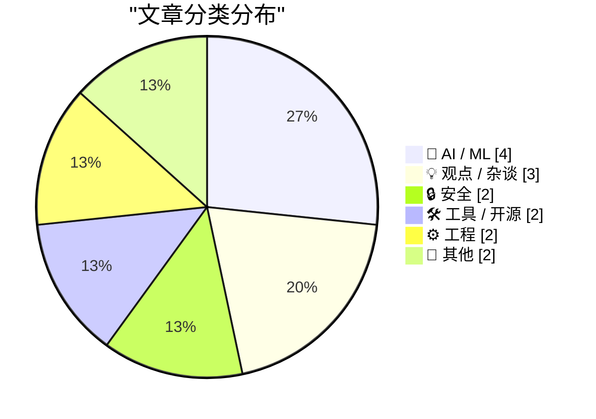
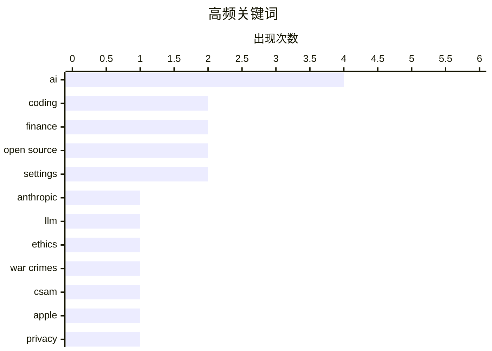

# 📰 AI 博客每日精选 — 2026-02-28

> 来自 Karpathy 推荐的 92 个顶级技术博客，AI 精选 Top 15

## 📝 今日看点

今日看点：技术伦理与安全成为焦点，AI代码编写工具的应用与争议持续升温。大型科技公司在面对伦理和法律挑战时的立场备受关注，同时，AI代码编写工具的实际效果和潜在风险也引发了广泛讨论。此外，数据加密方法的安全性问题再次引发业内反思。

---

## 🏆 今日必读

🥇 **安索普拒绝为战争犯罪提供技术支持**

[A Cookie for Dario? — Anthropic and selling death](https://anildash.com/2026/02/27/a-cookie-for-dario/) — anildash.com · 8 小时前 · 🤖 AI / ML

> 安索普（Claude 的开发者）拒绝国防部长的要求，不修改其平台以支持战争犯罪。安索普 CEO 达里奥·阿莫迪拒绝了这一要求，认为其可能被用于非法目的。文章讨论了大型科技公司在伦理和法律问题上的立场。安索普的立场表明，技术公司在面对政府压力时，需要坚持伦理和法律底线。

💡 **为什么值得读**: 了解大型科技公司在面对政府压力时如何坚持伦理和法律底线，对技术从业者和政策制定者都有重要参考价值。

🏷️ Anthropic, LLM, ethics, war crimes

🥈 **西弗吉尼亚州反苹果 CSAM 法律诉讼将帮助儿童猎人逃脱法律制裁**

[West Virginia’s Anti-Apple CSAM Lawsuit Would Help Child Predators Walk Free](https://www.techdirt.com/2026/02/25/west-virginias-anti-apple-csam-lawsuit-would-help-child-predators-walk-free/) — daringfireball.net · 12 小时前 · 🔒 安全

> 西弗吉尼亚州的反苹果 CSAM 法律诉讼如果成功，将导致苹果被迫扫描 iCloud 以寻找 CSAM 内容，这将违反第四修正案。被扫描的图像将成为无证搜查的证据，可能被法庭排除。文章指出，这种法律诉讼可能会帮助儿童猎人逃脱法律制裁。

💡 **为什么值得读**: 了解法律诉讼对技术公司和用户隐私的潜在影响，对技术从业者和法律专业人士都有重要启示。

🏷️ CSAM, Apple, privacy, law

🥉 **AI 代码编写怀疑者尝试 AI 代码编写，详细记录**

[An AI agent coding skeptic tries AI agent coding, in excessive detail](https://simonwillison.net/2026/Feb/27/ai-agent-coding-in-excessive-detail/#atom-everything) — simonwillison.net · 11 小时前 · 🤖 AI / ML

> Max Woolf 详细记录了他使用 AI 代码编写工具的经历，从简单的 YouTube 元数据抓取到复杂的项目。他展示了 AI 代码编写工具在不同项目中的应用和效果。文章强调了 AI 代码编写工具的潜力和实际应用。

💡 **为什么值得读**: 了解 AI 代码编写工具的实际应用和潜力，对开发者和技术爱好者都有重要参考价值。

🏷️ AI, coding, agents, machine learning

---

## 📊 数据概览

| 扫描源 | 抓取文章 | 时间范围 | 精选 |
|:---:|:---:|:---:|:---:|
| 88/92 | 2369 篇 → 23 篇 | 24h | **15 篇** |

### 分类分布



### 高频关键词



<details>
<summary>📈 纯文本关键词图（终端友好）</summary>

```
ai          │ ████████████████████ 4
coding      │ ██████████░░░░░░░░░░ 2
finance     │ ██████████░░░░░░░░░░ 2
open source │ ██████████░░░░░░░░░░ 2
settings    │ ██████████░░░░░░░░░░ 2
anthropic   │ █████░░░░░░░░░░░░░░░ 1
llm         │ █████░░░░░░░░░░░░░░░ 1
ethics      │ █████░░░░░░░░░░░░░░░ 1
war crimes  │ █████░░░░░░░░░░░░░░░ 1
csam        │ █████░░░░░░░░░░░░░░░ 1
```

</details>

### 🏷️ 话题标签

**ai**(4) · **coding**(2) · **finance**(2) · open source(2) · settings(2) · anthropic(1) · llm(1) · ethics(1) · war crimes(1) · csam(1) · apple(1) · privacy(1) · law(1) · agents(1) · machine learning(1) · agent(1) · skeptic(1) · passkeys(1) · encryption(1) · user data(1)

---

## 🤖 AI / ML

### 1. 安索普拒绝为战争犯罪提供技术支持

[A Cookie for Dario? — Anthropic and selling death](https://anildash.com/2026/02/27/a-cookie-for-dario/) — **anildash.com** · 8 小时前 · ⭐ 27/30

> 安索普（Claude 的开发者）拒绝国防部长的要求，不修改其平台以支持战争犯罪。安索普 CEO 达里奥·阿莫迪拒绝了这一要求，认为其可能被用于非法目的。文章讨论了大型科技公司在伦理和法律问题上的立场。安索普的立场表明，技术公司在面对政府压力时，需要坚持伦理和法律底线。

🏷️ Anthropic, LLM, ethics, war crimes

---

### 2. AI 代码编写怀疑者尝试 AI 代码编写，详细记录

[An AI agent coding skeptic tries AI agent coding, in excessive detail](https://simonwillison.net/2026/Feb/27/ai-agent-coding-in-excessive-detail/#atom-everything) — **simonwillison.net** · 11 小时前 · ⭐ 23/30

> Max Woolf 详细记录了他使用 AI 代码编写工具的经历，从简单的 YouTube 元数据抓取到复杂的项目。他展示了 AI 代码编写工具在不同项目中的应用和效果。文章强调了 AI 代码编写工具的潜力和实际应用。

🏷️ AI, coding, agents, machine learning

---

### 3. AI 代码编写怀疑者尝试 AI 代码编写，详细记录

[An AI agent coding skeptic tries AI agent coding, in excessive detail](https://minimaxir.com/2026/02/ai-agent-coding/) — **minimaxir.com** · 14 小时前 · ⭐ 23/30

> Max Woolf 详细记录了他使用 AI 代码编写工具的经历，从简单的 YouTube 元数据抓取到复杂的项目。他展示了 AI 代码编写工具在不同项目中的应用和效果。文章强调了 AI 代码编写工具的潜力和实际应用。

🏷️ AI, coding, agent, skeptic

---

### 4. OpenAI 的新融资是否合理？

[Does OpenAI’s new financing make sense?](https://garymarcus.substack.com/p/does-openais-new-financing-make-sense) — **garymarcus.substack.com** · 12 小时前 · ⭐ 21/30

> Gary Marcus 对 OpenAI 的新融资表示怀疑，认为其合理性值得商榷。文章讨论了 OpenAI 的财务状况和未来发展。Gary Marcus 认为，OpenAI 的新融资可能存在风险。

🏷️ OpenAI, financing, AI, startup

---

## 💡 观点 / 杂谈

### 5. Block 解雇 4,000 名员工

[Block Lays Off 4,000 (of 10,000) Employees](https://www.cnbc.com/2026/02/26/block-laying-off-about-4000-employees-nearly-half-of-its-workforce.html) — **daringfireball.net** · 16 小时前 · ⭐ 20/30

> Block 宣布解雇 4,000 名员工，占其总员工数的一半。股价在宣布后大幅上涨。Jack Dorsey 在信中解释了这一决定，并表示公司将减少到 6,000 名员工。

🏷️ Block, layoffs, tech industry, finance

---

### 6. 计算机和互联网：一把双刃剑

[Computers and the Internet: A Two-Edged Sword](https://blog.jim-nielsen.com/2026/two-edged-sword-of-computers-and-internet/) — **blog.jim-nielsen.com** · 13 小时前 · ⭐ 19/30

> Dave Rupert 讨论了计算机和互联网对个人生活的双重影响。文章指出，计算机和互联网虽然带来了便利，但也可能导致依赖和负面影响。Dave Rupert 建议在使用计算机和互联网时保持平衡。

🏷️ computers, internet, technology, impact

---

### 7. Premium: The Hater's Guide to Private Equity

[Premium: The Hater's Guide to Private Equity](https://www.wheresyoured.at/hatersguide-pe/) — **wheresyoured.at** · 15 小时前 · ⭐ 16/30

> We have a global intelligence crisis, in that a lot of people are being really fucking stupid.As I discussed in this week&#x2019;s free piece, alleged financial analyst Citrini Research put out a trul

🏷️ private equity, finance, intelligence, critique

---

## 🔒 安全

### 8. 西弗吉尼亚州反苹果 CSAM 法律诉讼将帮助儿童猎人逃脱法律制裁

[West Virginia’s Anti-Apple CSAM Lawsuit Would Help Child Predators Walk Free](https://www.techdirt.com/2026/02/25/west-virginias-anti-apple-csam-lawsuit-would-help-child-predators-walk-free/) — **daringfireball.net** · 12 小时前 · ⭐ 26/30

> 西弗吉尼亚州的反苹果 CSAM 法律诉讼如果成功，将导致苹果被迫扫描 iCloud 以寻找 CSAM 内容，这将违反第四修正案。被扫描的图像将成为无证搜查的证据，可能被法庭排除。文章指出，这种法律诉讼可能会帮助儿童猎人逃脱法律制裁。

🏷️ CSAM, Apple, privacy, law

---

### 9. 请不要再使用密钥来加密用户数据

[Please, please, please stop using passkeys for encrypting user data](https://simonwillison.net/2026/Feb/27/passkeys/#atom-everything) — **simonwillison.net** · 9 小时前 · ⭐ 21/30

> Tim Cappalli 批评使用密钥来加密用户数据，因为用户经常丢失密钥，导致数据无法恢复。文章建议使用更安全的加密方法。Tim Cappalli 认为，密钥加密用户数据的做法存在严重风险。

🏷️ passkeys, encryption, user data, security

---

## 🛠 工具 / 开源

### 10. 为大型开源项目维护者提供免费的 Claude Max

[Free Claude Max for (large project) open source maintainers](https://simonwillison.net/2026/Feb/27/claude-max-oss-six-months/#atom-everything) — **simonwillison.net** · 14 小时前 · ⭐ 19/30

> 安索普为符合条件的开源项目维护者提供免费的 Claude Max 20x 计划，为期六个月。条件包括 GitHub 星标超过 5,000 或每月 NPM 下载量超过 100 万。安索普希望通过这一举措支持开源社区。

🏷️ Claude, open source, AI, maintainers

---

### 11. Unicode Explorer using binary search over fetch() HTTP range requests

[Unicode Explorer using binary search over fetch() HTTP range requests](https://simonwillison.net/2026/Feb/27/unicode-explorer/#atom-everything) — **simonwillison.net** · 14 小时前 · ⭐ 17/30

> <p><strong><a href="https://tools.simonwillison.net/unicode-binary-search">Unicode Explorer using binary search over fetch() HTTP range requests</a></strong></p>
Here's a little prototype I built this

🏷️ Unicode, HTTP, binary search, fetch

---

## ⚙️ 工程

### 12. 使用 Frigate 升级我的开源 Pi 监控服务器

[Upgrading my Open Source Pi Surveillance Server with Frigate](https://www.jeffgeerling.com/blog/2026/upgrading-my-open-source-pi-surveillance-server-frigate/) — **jeffgeerling.com** · 17 小时前 · ⭐ 18/30

> Jeff Geerling 详细记录了他使用 Frigate 和 Coral TPU 升级开源 Pi 监控服务器的过程。他展示了系统的性能和局部存储的优势。文章强调了开源监控系统的可靠性和隐私保护。

🏷️ Pi, Frigate, surveillance, open source

---

### 13. Intercepting messages inside Is­Dialog­Message, fine-tuning the message filter

[Intercepting messages inside Is­Dialog­Message, fine-tuning the message filter](https://devblogs.microsoft.com/oldnewthing/20260227-00/?p=112094) — **devblogs.microsoft.com/oldnewthing** · 17 小时前 · ⭐ 16/30

> Making sure it triggers when you need it, and not when you don't.
The post Intercepting messages inside <CODE>Is&shy;Dialog&shy;Message</CODE>, fine-tuning the message filter appeared first on The Old

🏷️ Windows, message, filter, dialog

---

## 📝 其他

### 14. How to Block the ‘Upgrade to Tahoe’ Alerts and System Settings Indicator

[How to Block the ‘Upgrade to Tahoe’ Alerts and System Settings Indicator](https://robservatory.com/block-the-upgrade-to-tahoe-alerts-and-system-settings-indicator/) — **daringfireball.net** · 13 小时前 · ⭐ 15/30

> Rob Griffiths, writing at The Robservatory:


  So I have macOS Tahoe on my laptop, but I’m keeping my desktop
Mac on macOS Sequoia for now. Which means I have the joy of
seeing things like this wonde

🏷️ macOS, updates, notifications, settings

---

### 15. ★ A Sometimes-Hidden Setting Controls What Happens When You Tap a Call in the iOS 26 Phone App

[★ A Sometimes-Hidden Setting Controls What Happens When You Tap a Call in the iOS 26 Phone App](https://daringfireball.net/2026/02/sometimes_hidden_setting_phone_app) — **daringfireball.net** · 14 小时前 · ⭐ 15/30

> Apple’s solution to this dilemma — to show the “Tap Recents to Call” in Settings if, and only if, Unified is the current view option in the Phone app — is lazy. And as a result, it’s quite confusing.

🏷️ iOS, Phone app, settings, user experience

---

*生成于 2026-02-28 08:20 | 扫描 88 源 → 获取 2369 篇 → 精选 15 篇*
*基于 [Hacker News Popularity Contest 2025](https://refactoringenglish.com/tools/hn-popularity/) RSS 源列表，由 [Andrej Karpathy](https://x.com/karpathy) 推荐*
*由「懂点儿AI」制作，欢迎关注同名微信公众号获取更多 AI 实用技巧 💡*
