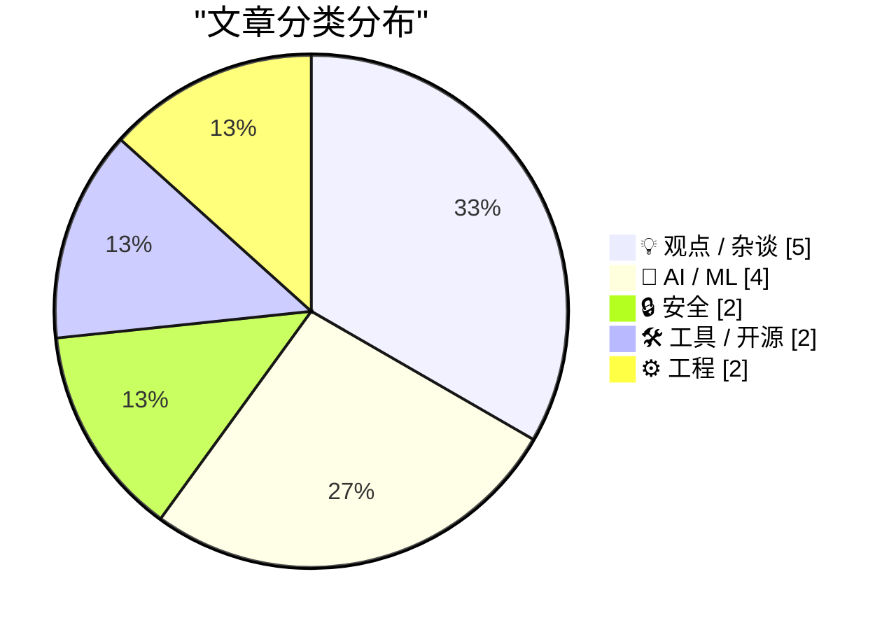
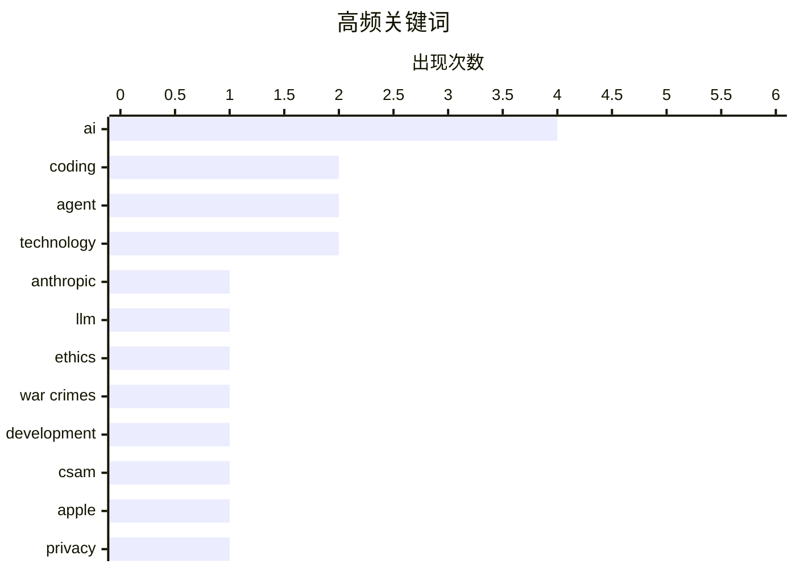

# 📰 AI 博客每日精选 — 2026-02-28

> 来自 Karpathy 推荐的 92 个顶级技术博客，AI 精选 Top 15

## 📝 今日看点

今日技术圈的主要看点集中在AI伦理与安全、AI工具的实际应用以及企业调整。安索普公司拒绝支持战争犯罪，凸显了AI伦理问题的重要性；同时，AI代码编写工具在实际项目中的应用也受到广泛关注。此外，企业如Block大规模裁员，反映了当前市场环境的动荡与调整。

---

## 🏆 今日必读

🥇 **安索普公司拒绝支持战争犯罪**

[A Cookie for Dario? — Anthropic and selling death](https://anildash.com/2026/02/27/a-cookie-for-dario/) — anildash.com · 8 小时前 · 🤖 AI / ML

> 安索普公司（Claude 的开发者）拒绝了国防部长彼得·赫格塞斯要求修改其平台以支持战争犯罪的请求。安索普公司CEO达里奥·阿莫迪拒绝了这一要求，尽管政府声称是为了“合法用途”。文章指出，政府将其犯罪行为描述为合法，这引发了对技术伦理的广泛讨论。安索普公司坚持其平台不应被用于非法目的。

💡 **为什么值得读**: 这篇文章揭示了大型科技公司在面对政府压力时如何维护技术伦理，值得关注。

🏷️ Anthropic, LLM, ethics, war crimes

🥈 **AI 代码编写的详细尝试**

[An AI agent coding skeptic tries AI agent coding, in excessive detail](https://simonwillison.net/2026/Feb/27/ai-agent-coding-in-excessive-detail/#atom-everything) — simonwillison.net · 11 小时前 · 🤖 AI / ML

> Max Woolf 详细描述了他使用 AI 代码编写工具的经历，从简单的 YouTube 元数据爬虫开始，逐步演变为更复杂的项目。他展示了 AI 代码编写工具在不同项目中的应用，并分享了其在实际编程中的表现。文章强调了 AI 代码编写工具的潜力和局限。

💡 **为什么值得读**: 这篇文章通过具体案例展示了 AI 代码编写工具的实际应用和效果，对开发者有很大的参考价值。

🏷️ AI, coding, agent, development

🥉 **AI 代码编写的详细尝试**

[An AI agent coding skeptic tries AI agent coding, in excessive detail](https://minimaxir.com/2026/02/ai-agent-coding/) — minimaxir.com · 14 小时前 · 🤖 AI / ML

> Max Woolf 详细描述了他使用 AI 代码编写工具的经历，从简单的 YouTube 元数据爬虫开始，逐步演变为更复杂的项目。他展示了 AI 代码编写工具在不同项目中的应用，并分享了其在实际编程中的表现。文章强调了 AI 代码编写工具的潜力和局限。

💡 **为什么值得读**: 这篇文章通过具体案例展示了 AI 代码编写工具的实际应用和效果，对开发者有很大的参考价值。

🏷️ AI, coding, agent

---

## 📊 数据概览

| 扫描源 | 抓取文章 | 时间范围 | 精选 |
|:---:|:---:|:---:|:---:|
| 87/92 | 2359 篇 → 23 篇 | 24h | **15 篇** |

### 分类分布



### 高频关键词



<details>
<summary>📈 纯文本关键词图（终端友好）</summary>

```
ai          │ ████████████████████ 4
coding      │ ██████████░░░░░░░░░░ 2
agent       │ ██████████░░░░░░░░░░ 2
technology  │ ██████████░░░░░░░░░░ 2
anthropic   │ █████░░░░░░░░░░░░░░░ 1
llm         │ █████░░░░░░░░░░░░░░░ 1
ethics      │ █████░░░░░░░░░░░░░░░ 1
war crimes  │ █████░░░░░░░░░░░░░░░ 1
development │ █████░░░░░░░░░░░░░░░ 1
csam        │ █████░░░░░░░░░░░░░░░ 1
```

</details>

### 🏷️ 话题标签

**ai**(4) · **coding**(2) · **agent**(2) · technology(2) · anthropic(1) · llm(1) · ethics(1) · war crimes(1) · development(1) · csam(1) · apple(1) · privacy(1) · legal(1) · openai(1) · financing(1) · passkeys(1) · encryption(1) · user data(1) · security(1) · claude(1)

---

## 💡 观点 / 杂谈

### 1. Block 解雇 4,000 名员工

[Block Lays Off 4,000 (of 10,000) Employees](https://www.cnbc.com/2026/02/26/block-laying-off-about-4000-employees-nearly-half-of-its-workforce.html) — **daringfireball.net** · 17 小时前 · ⭐ 18/30

> Block 宣布解雇 4,000 名员工，约占其员工总数的一半。公司股价在宣布后大幅上涨。Jack Dorsey 在信中解释了这一决定，并表示公司将从 10,000 人减少到 6,000 人。

🏷️ Block, layoffs, tech industry, finance

---

### 2. Computers and the Internet: A Two-Edged Sword

[Computers and the Internet: A Two-Edged Sword](https://blog.jim-nielsen.com/2026/two-edged-sword-of-computers-and-internet/) — **blog.jim-nielsen.com** · 13 小时前 · ⭐ 17/30

> <p>Dave Rupert articulated something in <a href="https://daverupert.com/2026/02/computers-were-a-mistake-for-me/" >“Priority of idle hands”</a> that’s been growing in my subconscious for years:</p>
<b

🏷️ internet, technology, impact, personal

---

### 3. Did Trump just overplay his hand?

[Did Trump just overplay his hand?](https://garymarcus.substack.com/p/did-trump-just-overplay-his-hand) — **garymarcus.substack.com** · 9 小时前 · ⭐ 16/30

> We will learn a lot about Silicon Valley in the upcoming days

🏷️ Silicon Valley, politics, technology

---

### 4. TUDUMB

[TUDUMB](https://spyglass.org/netflix-warner-bros-paramount-deal/) — **daringfireball.net** · 16 小时前 · ⭐ 15/30

> MG Siegler, writing at Spyglass:


  Of course, Netflix could have absorbed such a cost. It’s a $400B
company (well, before this deal, anyway) — double Disney!
Paramount Skydance? They’re worth $11B. 

🏷️ Netflix, mergers, acquisitions, media

---

### 5. We Need Process, But Process Gets in the Way

[We Need Process, But Process Gets in the Way](https://idiallo.com/blog/when-process-get-in-the-way?src=feed) — **idiallo.com** · 20 小时前 · ⭐ 15/30

> How do you manage a company with 50,000 employees? You need processes that give you visibility and control across every function such as technology, logistics, operations, and more. But the moment you

🏷️ process, management, company

---

## 🤖 AI / ML

### 6. 安索普公司拒绝支持战争犯罪

[A Cookie for Dario? — Anthropic and selling death](https://anildash.com/2026/02/27/a-cookie-for-dario/) — **anildash.com** · 8 小时前 · ⭐ 27/30

> 安索普公司（Claude 的开发者）拒绝了国防部长彼得·赫格塞斯要求修改其平台以支持战争犯罪的请求。安索普公司CEO达里奥·阿莫迪拒绝了这一要求，尽管政府声称是为了“合法用途”。文章指出，政府将其犯罪行为描述为合法，这引发了对技术伦理的广泛讨论。安索普公司坚持其平台不应被用于非法目的。

🏷️ Anthropic, LLM, ethics, war crimes

---

### 7. AI 代码编写的详细尝试

[An AI agent coding skeptic tries AI agent coding, in excessive detail](https://simonwillison.net/2026/Feb/27/ai-agent-coding-in-excessive-detail/#atom-everything) — **simonwillison.net** · 11 小时前 · ⭐ 25/30

> Max Woolf 详细描述了他使用 AI 代码编写工具的经历，从简单的 YouTube 元数据爬虫开始，逐步演变为更复杂的项目。他展示了 AI 代码编写工具在不同项目中的应用，并分享了其在实际编程中的表现。文章强调了 AI 代码编写工具的潜力和局限。

🏷️ AI, coding, agent, development

---

### 8. AI 代码编写的详细尝试

[An AI agent coding skeptic tries AI agent coding, in excessive detail](https://minimaxir.com/2026/02/ai-agent-coding/) — **minimaxir.com** · 14 小时前 · ⭐ 25/30

> Max Woolf 详细描述了他使用 AI 代码编写工具的经历，从简单的 YouTube 元数据爬虫开始，逐步演变为更复杂的项目。他展示了 AI 代码编写工具在不同项目中的应用，并分享了其在实际编程中的表现。文章强调了 AI 代码编写工具的潜力和局限。

🏷️ AI, coding, agent

---

### 9. OpenAI 的新融资是否合理？

[Does OpenAI’s new financing make sense?](https://garymarcus.substack.com/p/does-openais-new-financing-make-sense) — **garymarcus.substack.com** · 12 小时前 · ⭐ 24/30

> Gary Marcus 对 OpenAI 的新融资提出了质疑，认为其合理性存在疑问。文章分析了 OpenAI 的财务状况和市场前景，指出其融资策略可能存在风险。Gary Marcus 认为，OpenAI 的融资计划需要更多的透明度和合理性。

🏷️ OpenAI, financing, AI

---

## 🔒 安全

### 10. 西弗吉尼亚州反苹果 CSAM 诉讼将帮助儿童猎人逃脱法律制裁

[West Virginia’s Anti-Apple CSAM Lawsuit Would Help Child Predators Walk Free](https://www.techdirt.com/2026/02/25/west-virginias-anti-apple-csam-lawsuit-would-help-child-predators-walk-free/) — **daringfireball.net** · 13 小时前 · ⭐ 24/30

> 西弗吉尼亚州的反苹果 CSAM 诉讼如果成功，将迫使苹果扫描 iCloud 中的 CSAM，这将导致证据被无理由搜查，违反第四修正案。这意味着被捕的儿童猎人可能会因证据被排除而逃脱法律制裁。文章强调了这一诉讼的潜在危害和法律后果。

🏷️ CSAM, Apple, privacy, legal

---

### 11. 请不要使用密钥加密用户数据

[Please, please, please stop using passkeys for encrypting user data](https://simonwillison.net/2026/Feb/27/passkeys/#atom-everything) — **simonwillison.net** · 9 小时前 · ⭐ 21/30

> Tim Cappalli 强烈建议不要使用密钥加密用户数据，因为用户经常丢失密钥，导致数据无法恢复。文章指出，密钥加密存在安全风险，应避免使用。Tim Cappalli 呼吁身份验证行业停止推广和使用密钥加密用户数据。

🏷️ passkeys, encryption, user data, security

---

## 🛠 工具 / 开源

### 12. 免费提供 Claude Max 给大型开源项目维护者

[Free Claude Max for (large project) open source maintainers](https://simonwillison.net/2026/Feb/27/claude-max-oss-six-months/#atom-everything) — **simonwillison.net** · 14 小时前 · ⭐ 19/30

> Anthropic 为符合条件的开源项目维护者提供免费的 Claude Max 20x 计划，持续六个月。符合条件的维护者需要是公共仓库的主要维护者或核心团队成员，且仓库需要有 5,000+ GitHub 星标或 1M+ 每月 NPM 下载量。

🏷️ Claude, open source, AI, maintainers

---

### 13. 使用 Frigate 升级我的开源 Pi 监控服务器

[Upgrading my Open Source Pi Surveillance Server with Frigate](https://www.jeffgeerling.com/blog/2026/upgrading-my-open-source-pi-surveillance-server-frigate/) — **jeffgeerling.com** · 17 小时前 · ⭐ 18/30

> Jeff Geerling 在 2024 年建立了一个基于 Pi 的 Frigate NVR，使用 Coral TPU 进行物体检测，完全本地化，无需云集成。文章详细描述了升级过程和性能提升，强调了本地监控的优势。

🏷️ Frigate, surveillance, Raspberry Pi, object detection

---

## ⚙️ 工程

### 14. 使用二进制搜索和 fetch() HTTP 范围请求的 Unicode Explorer

[Unicode Explorer using binary search over fetch() HTTP range requests](https://simonwillison.net/2026/Feb/27/unicode-explorer/#atom-everything) — **simonwillison.net** · 14 小时前 · ⭐ 17/30

> Simon Willison 使用二进制搜索和 fetch() HTTP 范围请求构建了一个 Unicode Explorer 原型。文章详细描述了技术实现和应用场景，展示了如何利用 LLMs 满足好奇心。

🏷️ Unicode, HTTP, binary search, fetch

---

### 15. Intercepting messages inside Is­Dialog­Message, fine-tuning the message filter

[Intercepting messages inside Is­Dialog­Message, fine-tuning the message filter](https://devblogs.microsoft.com/oldnewthing/20260227-00/?p=112094) — **devblogs.microsoft.com/oldnewthing** · 17 小时前 · ⭐ 16/30

> Making sure it triggers when you need it, and not when you don't.
The post Intercepting messages inside <CODE>Is&shy;Dialog&shy;Message</CODE>, fine-tuning the message filter appeared first on The Old

🏷️ Windows, message, filtering

---

*生成于 2026-02-28 08:42 | 扫描 87 源 → 获取 2359 篇 → 精选 15 篇*
*基于 [Hacker News Popularity Contest 2025](https://refactoringenglish.com/tools/hn-popularity/) RSS 源列表，由 [Andrej Karpathy](https://x.com/karpathy) 推荐*
*由「懂点儿AI」制作，欢迎关注同名微信公众号获取更多 AI 实用技巧 💡*
