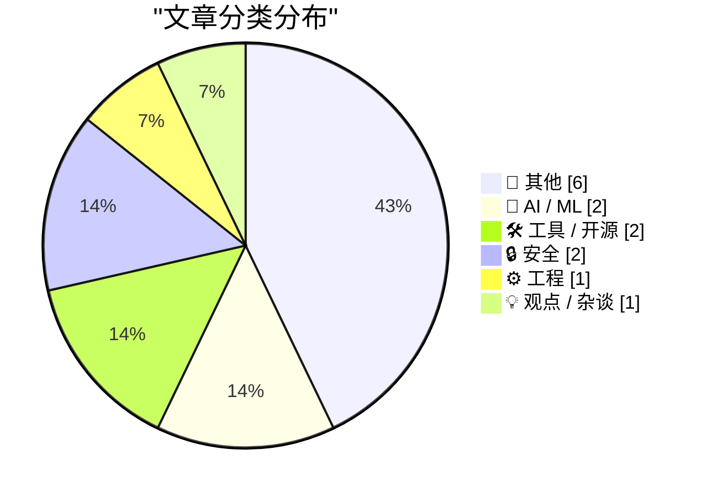
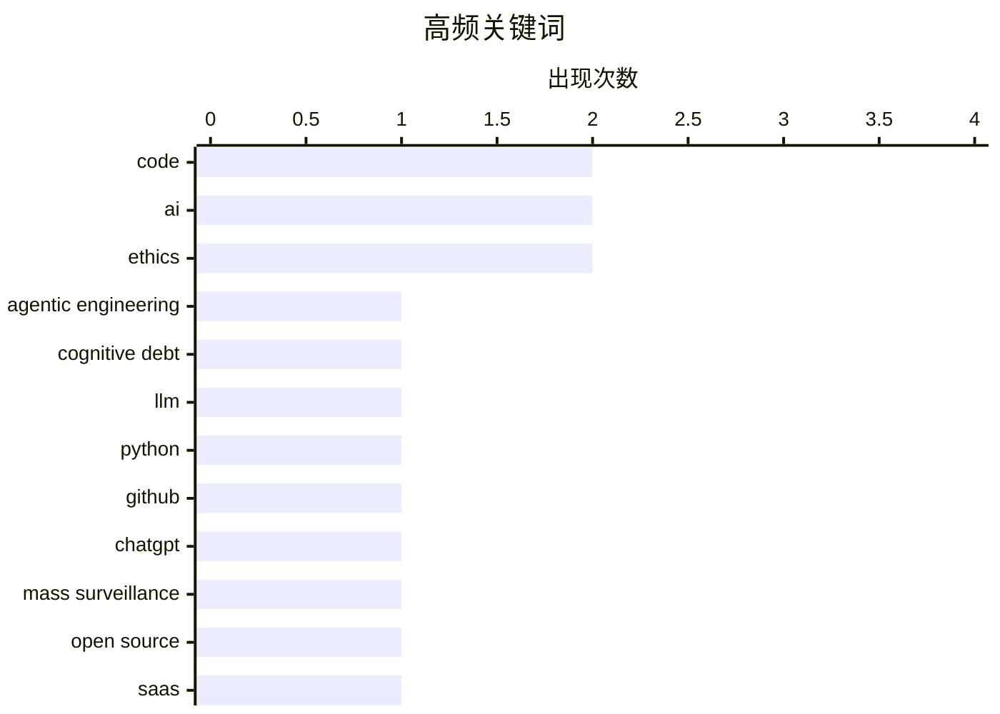

# 📰 AI 博客每日精选 — 2026-03-01

> 来自 Karpathy 推荐的 92 个顶级技术博客，AI 精选 Top 14

## 📝 今日看点

今日技术圈的主要看点集中在代码生成与管理、人工智能伦理及网络安全威胁。开发者们正在探索如何通过交互式解释和代理依赖管理来提升代码质量，同时也在关注无限代码生成技术对开源社区和 SaaS 提供商的影响。此外，ChatGPT 在军事领域的潜在应用引发了广泛担忧，而 Kimwolf 机器人网络的主控者“Dort”则对网络安全构成了严重威胁。

---

## 🏆 今日必读

🥇 **交互式解释**

[Interactive explanations](https://simonwillison.net/guides/agentic-engineering-patterns/interactive-explanations/#atom-everything) — simonwillison.net · 1 小时前 · ⚙️ 工程

> 代理编写的代码可能导致认知债务。对于简单的数据获取和输出任务，实现细节通常不需要深入理解。然而，复杂的代码需要交互式解释来减少认知负担。通过使用交互式解释，开发者可以更好地理解和维护代码，从而提高开发效率。

💡 **为什么值得读**: 了解如何通过交互式解释减少代理编写代码带来的认知债务，提升代码维护效率。

🏷️ agentic engineering, cognitive debt, code, AI

🥈 **LLM 在 Python 源代码中的应用**

[LLM Use in the Python Source Code](https://blog.miguelgrinberg.com/post/llm-use-in-the-python-source-code) — miguelgrinberg.com · 9 小时前 · 🤖 AI / ML

> 通过在 GitHub 上阻止特定用户，可以识别出依赖编码代理的项目。例如，CPython 项目中使用了 Claude Code 代理。这种方法有助于开发者识别和管理代码库中的代理依赖，确保代码质量和安全性。

💡 **为什么值得读**: 了解如何通过社交媒体技巧识别和管理 Python 项目中的代理依赖，确保代码质量。

🏷️ LLM, Python, GitHub, code

🥉 **取消我的 ChatGPT 账户**

[That's it, I'm cancelling my ChatGPT](https://idiallo.com/byte-size/im-cancelling-my-chatgpt-openai-account?src=feed) — idiallo.com · 6 小时前 · 🤖 AI / ML

> Sam Altman 的推文引发了对 ChatGPT 在军事网络中的应用的担忧。这可能导致大规模监控和武器部署。Anthropic 的 CEO 拒绝与国防部合作，表明对技术滥用的担忧。

💡 **为什么值得读**: 了解 ChatGPT 在军事领域的潜在应用及其伦理和安全问题，有助于更好地理解技术的社会影响。

🏷️ ChatGPT, mass surveillance, AI, ethics

---

## 📊 数据概览

| 扫描源 | 抓取文章 | 时间范围 | 精选 |
|:---:|:---:|:---:|:---:|
| 88/92 | 2369 篇 → 14 篇 | 24h | **14 篇** |

### 分类分布



### 高频关键词



<details>
<summary>📈 纯文本关键词图（终端友好）</summary>

```
code                │ ████████████████████ 2
ai                  │ ████████████████████ 2
ethics              │ ████████████████████ 2
agentic engineering │ ██████████░░░░░░░░░░ 1
cognitive debt      │ ██████████░░░░░░░░░░ 1
llm                 │ ██████████░░░░░░░░░░ 1
python              │ ██████████░░░░░░░░░░ 1
github              │ ██████████░░░░░░░░░░ 1
chatgpt             │ ██████████░░░░░░░░░░ 1
mass surveillance   │ ██████████░░░░░░░░░░ 1
```

</details>

### 🏷️ 话题标签

**code**(2) · **ai**(2) · **ethics**(2) · agentic engineering(1) · cognitive debt(1) · llm(1) · python(1) · github(1) · chatgpt(1) · mass surveillance(1) · open source(1) · saas(1) · code generation(1) · botnet(1) · cybersecurity(1) · vulnerability(1) · kimwolf(1) · microservices(1) · architecture(1) · software design(1)

---

## 📝 其他

### 1. 2026年2月28日阅读清单

[Reading List 02/28/26](https://www.construction-physics.com/p/reading-list-022826) — **construction-physics.com** · 10 小时前 · ⭐ 15/30

> 文章列出了当前热点话题，包括建筑许可成本、房地产市场、电子产品停产、自动驾驶技术和地热能进展。通过这些话题，可以了解当前科技和社会的发展趋势。

🏷️ LA permitting, housing, geothermal

---

### 2. 30个月到3兆瓦时 - 家庭电池统计数据

[30 months to 3MWh - some more home battery stats](https://shkspr.mobi/blog/2026/02/30-months-to-3mwh-some-more-home-battery-stats/) — **shkspr.mobi** · 11 小时前 · ⭐ 14/30

> 文章介绍了家庭电池系统的使用情况，展示了其在节能和成本节约方面的效果。通过具体数据，展示了家庭电池系统的实际应用价值。

🏷️ home battery, solar energy, energy storage

---

### 3. Approximation game

[Approximation game](https://lcamtuf.substack.com/p/approximation-game) — **lcamtuf.substack.com** · 21 小时前 · ⭐ 12/30

> The number 22/7 and the pigeon flock of Peter Gustav Lejeune Dirichlet.

🏷️ mathematics, approximation, Dirichlet

---

### 4. Pluralistic: California can stop Larry Ellison from buying Warners (28 Feb 2026)

[Pluralistic: California can stop Larry Ellison from buying Warners (28 Feb 2026)](https://pluralistic.net/2026/02/28/golden-mean/) — **pluralistic.net** · 13 小时前 · ⭐ 10/30

> Today's links California can stop Larry Ellison from buying Warners: These are the right states' rights. Hey look at this: Delights to delectate. Object permanence: RIP Octavia Butler; "Midnighters"; 

🏷️ business, media, Larry Ellison, regulation

---

### 5. Trump’s Enormous Gamble on Regime Change in Iran

[Trump’s Enormous Gamble on Regime Change in Iran](https://www.theatlantic.com/ideas/2026/02/trumps-iran-regime-change-attack-gamble/686190/?gift=aQyUJR7AIw1mJWdQ6Ed6yOWB4bfod1kQqCyz2RXbHaY) — **daringfireball.net** · 8 小时前 · ⭐ 9/30

> Tom Nichols, writing for The Atlantic:


  When the 2003 war with Iraq ended, U.S. Ambassador Barbara Bodine said that when American diplomats embarked on reconstruction, they ruefully joked that “the

🏷️ politics, Iran, reconstruction

---

### 6. The whole thing was a scam

[The whole thing was a scam](https://garymarcus.substack.com/p/the-whole-thing-was-scam) — **garymarcus.substack.com** · 7 小时前 · ⭐ 8/30

> The fix was in, and Dario never had a chance.

🏷️ scam, ethics, fraud

---

## 🤖 AI / ML

### 7. LLM 在 Python 源代码中的应用

[LLM Use in the Python Source Code](https://blog.miguelgrinberg.com/post/llm-use-in-the-python-source-code) — **miguelgrinberg.com** · 9 小时前 · ⭐ 24/30

> 通过在 GitHub 上阻止特定用户，可以识别出依赖编码代理的项目。例如，CPython 项目中使用了 Claude Code 代理。这种方法有助于开发者识别和管理代码库中的代理依赖，确保代码质量和安全性。

🏷️ LLM, Python, GitHub, code

---

### 8. 取消我的 ChatGPT 账户

[That's it, I'm cancelling my ChatGPT](https://idiallo.com/byte-size/im-cancelling-my-chatgpt-openai-account?src=feed) — **idiallo.com** · 6 小时前 · ⭐ 23/30

> Sam Altman 的推文引发了对 ChatGPT 在军事网络中的应用的担忧。这可能导致大规模监控和武器部署。Anthropic 的 CEO 拒绝与国防部合作，表明对技术滥用的担忧。

🏷️ ChatGPT, mass surveillance, AI, ethics

---

## 🛠 工具 / 开源

### 9. 开源、SaaS 和无限代码生成的沉默

[Open Source, SaaS, and the Silence After Unlimited Code Generation](https://worksonmymachine.ai/p/open-source-saas-and-the-silence) — **worksonmymachine.substack.com** · 9 小时前 · ⭐ 23/30

> 无限代码生成技术的普及导致了反馈的减少。开源社区和 SaaS 提供商需要重新评估代码生成的影响，以确保代码质量和安全性。

🏷️ open source, SaaS, code generation

---

### 10. 在 Bash 脚本中处理文件扩展名

[Working with file extensions in bash scripts](https://www.johndcook.com/blog/2026/02/28/file-extensions-bash/) — **johndcook.com** · 5 小时前 · ⭐ 19/30

> Bash 脚本在处理文件扩展名时具有简洁和高效的特性。通过示例，展示了如何使用 Bash 脚本处理常见的文件扩展名问题。

🏷️ bash scripting, file extensions, shell scripting

---

## 🔒 安全

### 11. Kimwolf 机器人主控者“Dort”是谁？

[Who is the Kimwolf Botmaster “Dort”?](https://krebsonsecurity.com/2026/02/who-is-the-kimwolf-botmaster-dort/) — **krebsonsecurity.com** · 12 小时前 · ⭐ 20/30

> Kimwolf 是全球最大的分布式拒绝服务（DDoS）机器人网络。主控者“Dort”对揭露其漏洞的安全研究人员进行了多次攻击。文章探讨了“Dort”的身份和动机，以及其对网络安全的威胁。

🏷️ botnet, cybersecurity, vulnerability, Kimwolf

---

### 12. npm 数据主体访问请求

[npm Data Subject Access Request](https://nesbitt.io/2026/02/28/npm-data-subject-access-request.html) — **nesbitt.io** · 14 小时前 · ⭐ 16/30

> 文章回应了 GDPR 数据主体访问请求，讨论了如何处理用户数据的访问和管理。通过具体案例，展示了数据隐私保护的重要性。

🏷️ GDPR, data privacy, npm, data access

---

## ⚙️ 工程

### 13. 交互式解释

[Interactive explanations](https://simonwillison.net/guides/agentic-engineering-patterns/interactive-explanations/#atom-everything) — **simonwillison.net** · 1 小时前 · ⭐ 24/30

> 代理编写的代码可能导致认知债务。对于简单的数据获取和输出任务，实现细节通常不需要深入理解。然而，复杂的代码需要交互式解释来减少认知负担。通过使用交互式解释，开发者可以更好地理解和维护代码，从而提高开发效率。

🏷️ agentic engineering, cognitive debt, code, AI

---

## 💡 观点 / 杂谈

### 14. 最重要的微型计算机

[The Most Important Micros](https://www.abortretry.fail/p/the-most-important-micros) — **abortretry.fail** · 5 小时前 · ⭐ 20/30

> 文章讨论了微型计算机在技术发展中的重要性。通过分析其代表的意义，可以更好地理解其在现代计算中的作用。

🏷️ microservices, architecture, software design

---

*生成于 2026-03-01 00:15 | 扫描 88 源 → 获取 2369 篇 → 精选 14 篇*
*基于 [Hacker News Popularity Contest 2025](https://refactoringenglish.com/tools/hn-popularity/) RSS 源列表，由 [Andrej Karpathy](https://x.com/karpathy) 推荐*
*由「懂点儿AI」制作，欢迎关注同名微信公众号获取更多 AI 实用技巧 💡*
