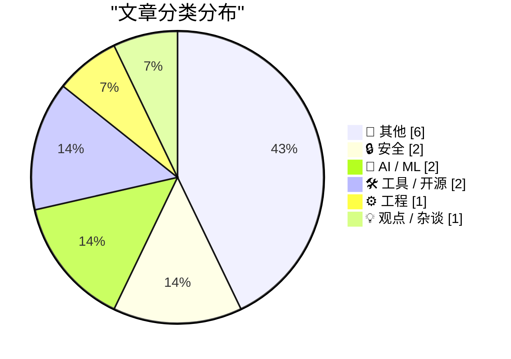
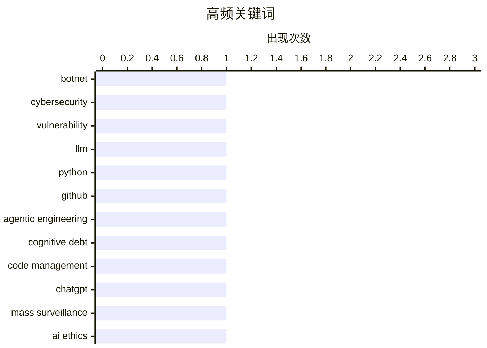

# 📰 AI 博客每日精选 — 2026-03-01

> 来自 Karpathy 推荐的 92 个顶级技术博客，AI 精选 Top 14

## 📝 今日看点

今日看点：技术圈关注点集中在网络安全威胁与大型语言模型的应用。Kimwolf 机器人网络的操控者“Dort”引发了广泛关注，暴露了网络安全的脆弱性。同时，大型语言模型在代码生成和军事应用中的潜力与风险也成为热议话题。此外，开源和 SaaS 领域的无限代码生成技术逐渐普及，但反馈和讨论逐渐减少，引发了对开发者社区未来发展的思考。

---

## 🏆 今日必读

🥇 **Kimwolf 机器人网络的操控者“Dort”是谁？**

[Who is the Kimwolf Botmaster “Dort”?](https://krebsonsecurity.com/2026/02/who-is-the-kimwolf-botmaster-dort/) — krebsonsecurity.com · 12 小时前 · 🔒 安全

> Kimwolf 是全球最大且最具破坏性的机器人网络。该网络的操控者“Dort”发起了多次分布式拒绝服务（DDoS）攻击、泄露个人信息和电子邮件洪水攻击。文章分析了“Dort”的身份和行为，揭示了其通过 Kimwolf 发起的攻击手段。研究人员和作者受到攻击，甚至导致 SWAT 突击队被派往研究人员的家中。

💡 **为什么值得读**: 了解 Kimwolf 机器人网络的背后操控者及其攻击手段，有助于提升网络安全意识和防御策略。

🏷️ botnet, cybersecurity, vulnerability

🥈 **LLM 在 Python 源代码中的应用**

[LLM Use in the Python Source Code](https://blog.miguelgrinberg.com/post/llm-use-in-the-python-source-code) — miguelgrinberg.com · 8 小时前 · 🤖 AI / ML

> 在 GitHub 上阻止 Claude 用户，可以通过警告横幅识别依赖 Claude Code 的项目。CPython 代码库中出现了 Claude 的提交记录，表明大型语言模型（LLM）正在被用于 Python 源代码的开发。这种趋势可能会改变开发者的编程习惯和代码审查流程。

💡 **为什么值得读**: 了解 LLM 在 Python 源代码中的应用，有助于开发者更好地适应和利用新技术。

🏷️ LLM, Python, GitHub

🥉 **交互式解释**

[Interactive explanations](https://simonwillison.net/guides/agentic-engineering-patterns/interactive-explanations/#atom-everything) — simonwillison.net · 1 小时前 · ⚙️ 工程

> 代理编写的代码可能导致认知债务，即开发者难以理解代码的工作原理。交互式解释可以帮助开发者更好地理解代码，特别是在处理复杂任务时。通过交互式解释，开发者可以减少认知债务，提高代码的可维护性和可理解性。

💡 **为什么值得读**: 掌握交互式解释技术，可以显著提升代码的可维护性和开发效率。

🏷️ agentic engineering, cognitive debt, code management

---

## 📊 数据概览

| 扫描源 | 抓取文章 | 时间范围 | 精选 |
|:---:|:---:|:---:|:---:|
| 87/92 | 2359 篇 → 14 篇 | 24h | **14 篇** |

### 分类分布



### 高频关键词



<details>
<summary>📈 纯文本关键词图（终端友好）</summary>

```
botnet              │ ████████████████████ 1
cybersecurity       │ ████████████████████ 1
vulnerability       │ ████████████████████ 1
llm                 │ ████████████████████ 1
python              │ ████████████████████ 1
github              │ ████████████████████ 1
agentic engineering │ ████████████████████ 1
cognitive debt      │ ████████████████████ 1
code management     │ ████████████████████ 1
chatgpt             │ ████████████████████ 1
```

</details>

### 🏷️ 话题标签

**botnet**(1) · **cybersecurity**(1) · **vulnerability**(1) · llm(1) · python(1) · github(1) · agentic engineering(1) · cognitive debt(1) · code management(1) · chatgpt(1) · mass surveillance(1) · ai ethics(1) · open source(1) · saas(1) · code generation(1) · bash scripting(1) · file extensions(1) · shell scripting(1) · microservices(1) · architecture(1)

---

## 📝 其他

### 1. 30 个月到 3MWh - 更多家用电池统计数据

[30 months to 3MWh - some more home battery stats](https://shkspr.mobi/blog/2026/02/30-months-to-3mwh-some-more-home-battery-stats/) — **shkspr.mobi** · 11 小时前 · ⭐ 15/30

> Moixa 4.8kWh 太阳能电池在过去一年半中累计储存了约 3 兆瓦时的电能。文章分析了电池的性能和节能效果，展示了家用电池在节能和环保方面的潜力。

🏷️ home battery, solar energy, energy storage

---

### 2. 2026年2月28日阅读清单

[Reading List 02/28/26](https://www.construction-physics.com/p/reading-list-022826) — **construction-physics.com** · 10 小时前 · ⭐ 15/30

> 文章汇总了关于洛杉矶许可成本、房屋供应链、Panasonic 停产电视、无人驾驶汽车远程操作员和地热能进展等多个话题的阅读资源。通过这些资源，读者可以了解最新的技术和行业动态。

🏷️ housing, geothermal, robotaxi

---

### 3. Pluralistic: California can stop Larry Ellison from buying Warners (28 Feb 2026)

[Pluralistic: California can stop Larry Ellison from buying Warners (28 Feb 2026)](https://pluralistic.net/2026/02/28/golden-mean/) — **pluralistic.net** · 12 小时前 · ⭐ 13/30

> Today's links California can stop Larry Ellison from buying Warners: These are the right states' rights. Hey look at this: Delights to delectate. Object permanence: RIP Octavia Butler; "Midnighters"; 

🏷️ business, acquisitions, state rights

---

### 4. Approximation game

[Approximation game](https://lcamtuf.substack.com/p/approximation-game) — **lcamtuf.substack.com** · 21 小时前 · ⭐ 12/30

> The number 22/7 and the pigeon flock of Peter Gustav Lejeune Dirichlet.

🏷️ mathematics, approximation, pigeonhole principle

---

### 5. Trump’s Enormous Gamble on Regime Change in Iran

[Trump’s Enormous Gamble on Regime Change in Iran](https://www.theatlantic.com/ideas/2026/02/trumps-iran-regime-change-attack-gamble/686190/?gift=aQyUJR7AIw1mJWdQ6Ed6yOWB4bfod1kQqCyz2RXbHaY) — **daringfireball.net** · 8 小时前 · ⭐ 10/30

> Tom Nichols, writing for The Atlantic:


  When the 2003 war with Iraq ended, U.S. Ambassador Barbara Bodine said that when American diplomats embarked on reconstruction, they ruefully joked that “the

🏷️ politics, Iran, reconstruction

---

### 6. The whole thing was a scam

[The whole thing was a scam](https://garymarcus.substack.com/p/the-whole-thing-was-scam) — **garymarcus.substack.com** · 7 小时前 · ⭐ 9/30

> The fix was in, and Dario never had a chance.

🏷️ scam, ethics, fraud

---

## 🔒 安全

### 7. Kimwolf 机器人网络的操控者“Dort”是谁？

[Who is the Kimwolf Botmaster “Dort”?](https://krebsonsecurity.com/2026/02/who-is-the-kimwolf-botmaster-dort/) — **krebsonsecurity.com** · 12 小时前 · ⭐ 27/30

> Kimwolf 是全球最大且最具破坏性的机器人网络。该网络的操控者“Dort”发起了多次分布式拒绝服务（DDoS）攻击、泄露个人信息和电子邮件洪水攻击。文章分析了“Dort”的身份和行为，揭示了其通过 Kimwolf 发起的攻击手段。研究人员和作者受到攻击，甚至导致 SWAT 突击队被派往研究人员的家中。

🏷️ botnet, cybersecurity, vulnerability

---

### 8. npm 数据主体访问请求

[npm Data Subject Access Request](https://nesbitt.io/2026/02/28/npm-data-subject-access-request.html) — **nesbitt.io** · 14 小时前 · ⭐ 16/30

> 文章回应了 GDPR 数据主体访问请求，详细说明了如何处理用户数据请求。通过分析具体案例，文章展示了如何在遵守隐私法规的同时，提供透明和安全的数据访问服务。

🏷️ GDPR, data privacy, data subject access

---

## 🤖 AI / ML

### 9. LLM 在 Python 源代码中的应用

[LLM Use in the Python Source Code](https://blog.miguelgrinberg.com/post/llm-use-in-the-python-source-code) — **miguelgrinberg.com** · 8 小时前 · ⭐ 25/30

> 在 GitHub 上阻止 Claude 用户，可以通过警告横幅识别依赖 Claude Code 的项目。CPython 代码库中出现了 Claude 的提交记录，表明大型语言模型（LLM）正在被用于 Python 源代码的开发。这种趋势可能会改变开发者的编程习惯和代码审查流程。

🏷️ LLM, Python, GitHub

---

### 10. 取消我的 ChatGPT 账户

[That's it, I'm cancelling my ChatGPT](https://idiallo.com/byte-size/im-cancelling-my-chatgpt-openai-account?src=feed) — **idiallo.com** · 6 小时前 · ⭐ 24/30

> Sam Altman 的推文引发了对 ChatGPT 在军事领域应用的担忧。ChatGPT 可能被用于大规模监控和武器部署，这引发了对隐私和安全的重大关切。Anthropic 的 CEO 拒绝与国防部合作，表明对技术滥用的担忧。

🏷️ ChatGPT, mass surveillance, AI ethics

---

## 🛠 工具 / 开源

### 11. 开源、SaaS 和无限代码生成的沉默

[Open Source, SaaS, and the Silence After Unlimited Code Generation](https://worksonmymachine.ai/p/open-source-saas-and-the-silence) — **worksonmymachine.substack.com** · 9 小时前 · ⭐ 23/30

> 无限代码生成技术在开源和 SaaS 领域的应用引发了广泛讨论。然而，随着技术的普及，反馈和讨论逐渐减少。文章探讨了这种现象背后的原因及其对开发者社区的影响。

🏷️ open source, SaaS, code generation

---

### 12. 在 Bash 脚本中处理文件扩展名

[Working with file extensions in bash scripts](https://www.johndcook.com/blog/2026/02/28/file-extensions-bash/) — **johndcook.com** · 5 小时前 · ⭐ 19/30

> Bash 脚本在处理文件扩展名时具有简洁和高效的特性。通过示例，文章展示了如何使用 Bash 脚本处理文件扩展名，提高脚本的可读性和维护性。

🏷️ bash scripting, file extensions, shell scripting

---

## ⚙️ 工程

### 13. 交互式解释

[Interactive explanations](https://simonwillison.net/guides/agentic-engineering-patterns/interactive-explanations/#atom-everything) — **simonwillison.net** · 1 小时前 · ⭐ 24/30

> 代理编写的代码可能导致认知债务，即开发者难以理解代码的工作原理。交互式解释可以帮助开发者更好地理解代码，特别是在处理复杂任务时。通过交互式解释，开发者可以减少认知债务，提高代码的可维护性和可理解性。

🏷️ agentic engineering, cognitive debt, code management

---

## 💡 观点 / 杂谈

### 14. 最重要的微处理器

[The Most Important Micros](https://www.abortretry.fail/p/the-most-important-micros) — **abortretry.fail** · 5 小时前 · ⭐ 18/30

> 文章探讨了微处理器在现代技术中的重要性及其代表的意义。通过分析微处理器的发展历史和应用场景，文章揭示了其在各个领域的关键作用。

🏷️ microservices, architecture, design

---

*生成于 2026-03-01 00:11 | 扫描 87 源 → 获取 2359 篇 → 精选 14 篇*
*基于 [Hacker News Popularity Contest 2025](https://refactoringenglish.com/tools/hn-popularity/) RSS 源列表，由 [Andrej Karpathy](https://x.com/karpathy) 推荐*
*由「懂点儿AI」制作，欢迎关注同名微信公众号获取更多 AI 实用技巧 💡*
