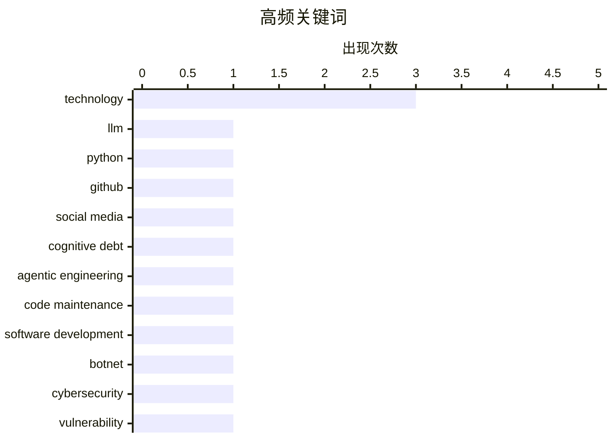

# 📰 AI 博客每日精选 — 2026-03-01

> 来自 Karpathy 推荐的 92 个顶级技术博客，AI 精选 Top 14

## 📝 今日看点

今日技术圈主要关注人工智能与安全问题。大语言模型在代码生成中的应用引发了对认知债务和代码理解的讨论，同时也引发了对其在军事领域潜在滥用的担忧。此外，网络安全领域曝光了Kimwolf机器人网络的破坏性攻击，提醒行业需加强防护措施。

---

## 🏆 今日必读

🥇 **Python 源代码中大语言模型的使用**

[LLM Use in the Python Source Code](https://blog.miguelgrinberg.com/post/llm-use-in-the-python-source-code) — miguelgrinberg.com · 9 小时前 · 🤖 AI / ML

> 通过在 GitHub 上阻止特定用户来识别依赖编码代理的项目。Claude Code 是一种特定的编码代理，通过阻止 GitHub 用户 claude，可以在访问相关仓库时显示提示。这种方法有助于识别使用 Claude Code 的项目。这种技术手段可以帮助开发者快速识别和管理代码库中的编码代理使用情况。

💡 **为什么值得读**: 了解如何通过简单的 GitHub 设置来识别和管理代码库中的编码代理，有助于提高代码库的透明度和安全性。

🏷️ LLM, Python, GitHub, social media

🥈 **互动解释**

[Interactive explanations](https://simonwillison.net/guides/agentic-engineering-patterns/interactive-explanations/#atom-everything) — simonwillison.net · 1 小时前 · ⚙️ 工程

> 代理编写的代码可能导致认知债务，即开发者难以理解代码的工作原理。对于简单的数据获取和输出任务，这种债务可能不重要，但对于复杂的功能，互动解释可以帮助开发者理解代码的工作原理。通过互动解释，开发者可以更好地管理和维护代码库。

💡 **为什么值得读**: 掌握互动解释的技术，可以显著提高代码的可维护性和开发效率。

🏷️ cognitive debt, agentic engineering, code maintenance, software development

🥉 **Kimwolf Botmaster “Dort” 是谁？**

[Who is the Kimwolf Botmaster “Dort”?](https://krebsonsecurity.com/2026/02/who-is-the-kimwolf-botmaster-dort/) — krebsonsecurity.com · 12 小时前 · 🔒 安全

> Kimwolf 是世界上最大的、最具破坏性的机器人网络，由一个名为 Dort 的人控制。自从曝光以来，Dort 发起了多次 DDoS 攻击、泄露个人信息和电子邮件洪水攻击。最近，Dort 还导致 SWAT 突击队被派往研究人员的家中。文章深入探讨了 Kimwolf 的背后操控者及其攻击行为。

💡 **为什么值得读**: 了解 Kimwolf 机器人网络的背后操控者及其攻击手段，有助于提高网络安全意识和防护措施。

🏷️ botnet, cybersecurity, vulnerability, Kimwolf

---

## 📊 数据概览

| 扫描源 | 抓取文章 | 时间范围 | 精选 |
|:---:|:---:|:---:|:---:|
| 88/92 | 2369 篇 → 14 篇 | 24h | **14 篇** |

### 分类分布


### 高频关键词



<details>
<summary>📈 纯文本关键词图（终端友好）</summary>

```
technology           │ ████████████████████ 3
llm                  │ ███████░░░░░░░░░░░░░ 1
python               │ ███████░░░░░░░░░░░░░ 1
github               │ ███████░░░░░░░░░░░░░ 1
social media         │ ███████░░░░░░░░░░░░░ 1
cognitive debt       │ ███████░░░░░░░░░░░░░ 1
agentic engineering  │ ███████░░░░░░░░░░░░░ 1
code maintenance     │ ███████░░░░░░░░░░░░░ 1
software development │ ███████░░░░░░░░░░░░░ 1
botnet               │ ███████░░░░░░░░░░░░░ 1
```

</details>

### 🏷️ 话题标签

**technology**(3) · **llm**(1) · **python**(1) · github(1) · social media(1) · cognitive debt(1) · agentic engineering(1) · code maintenance(1) · software development(1) · botnet(1) · cybersecurity(1) · vulnerability(1) · kimwolf(1) · chatgpt(1) · mass surveillance(1) · ai ethics(1) · ai deployment(1) · open source(1) · saas(1) · code generation(1)

---

## 📝 其他

### 1. 30 个月到 3MWh - 更多家庭电池统计数据

[30 months to 3MWh - some more home battery stats](https://shkspr.mobi/blog/2026/02/30-months-to-3mwh-some-more-home-battery-stats/) — **shkspr.mobi** · 11 小时前 · ⭐ 15/30

> Moixa 4.8kWh 太阳能电池在过去一年半中为家庭节省了约 3 兆瓦时的电能。这种电池通过吸收和释放电能，显著降低了家庭的电力成本。文章详细介绍了电池的工作原理和节能效果。

🏷️ home battery, solar energy, energy storage

---

### 2. 2026 年 2 月 28 日的阅读清单

[Reading List 02/28/26](https://www.construction-physics.com/p/reading-list-022826) — **construction-physics.com** · 10 小时前 · ⭐ 15/30

> 文章列出了 2026 年 2 月 28 日的阅读清单，涵盖了 LA 许可成本、房地产、电视制造、自动驾驶和地热能源等多个领域的最新进展。文章提供了丰富的资源和见解，帮助读者了解各个领域的最新动态。

🏷️ housing, technology, geothermal

---

### 3. Pluralistic: California can stop Larry Ellison from buying Warners (28 Feb 2026)

[Pluralistic: California can stop Larry Ellison from buying Warners (28 Feb 2026)](https://pluralistic.net/2026/02/28/golden-mean/) — **pluralistic.net** · 13 小时前 · ⭐ 12/30

> Today's links California can stop Larry Ellison from buying Warners: These are the right states' rights. Hey look at this: Delights to delectate. Object permanence: RIP Octavia Butler; "Midnighters"; 

🏷️ business, acquisition, media

---

### 4. Approximation game

[Approximation game](https://lcamtuf.substack.com/p/approximation-game) — **lcamtuf.substack.com** · 21 小时前 · ⭐ 12/30

> The number 22/7 and the pigeon flock of Peter Gustav Lejeune Dirichlet.

🏷️ mathematics, approximation, history

---

### 5. Trump’s Enormous Gamble on Regime Change in Iran

[Trump’s Enormous Gamble on Regime Change in Iran](https://www.theatlantic.com/ideas/2026/02/trumps-iran-regime-change-attack-gamble/686190/?gift=aQyUJR7AIw1mJWdQ6Ed6yOWB4bfod1kQqCyz2RXbHaY) — **daringfireball.net** · 8 小时前 · ⭐ 11/30

> Tom Nichols, writing for The Atlantic:


  When the 2003 war with Iraq ended, U.S. Ambassador Barbara Bodine said that when American diplomats embarked on reconstruction, they ruefully joked that “the

🏷️ politics, Iran, reconstruction

---

### 6. The whole thing was a scam

[The whole thing was a scam](https://garymarcus.substack.com/p/the-whole-thing-was-scam) — **garymarcus.substack.com** · 7 小时前 · ⭐ 9/30

> The fix was in, and Dario never had a chance.

🏷️ scam, ethics, technology

---

## 🤖 AI / ML

### 7. Python 源代码中大语言模型的使用

[LLM Use in the Python Source Code](https://blog.miguelgrinberg.com/post/llm-use-in-the-python-source-code) — **miguelgrinberg.com** · 9 小时前 · ⭐ 26/30

> 通过在 GitHub 上阻止特定用户来识别依赖编码代理的项目。Claude Code 是一种特定的编码代理，通过阻止 GitHub 用户 claude，可以在访问相关仓库时显示提示。这种方法有助于识别使用 Claude Code 的项目。这种技术手段可以帮助开发者快速识别和管理代码库中的编码代理使用情况。

🏷️ LLM, Python, GitHub, social media

---

### 8. 取消我的 ChatGPT 账户

[That's it, I'm cancelling my ChatGPT](https://idiallo.com/byte-size/im-cancelling-my-chatgpt-openai-account?src=feed) — **idiallo.com** · 6 小时前 · ⭐ 23/30

> Sam Altman 的推文引发了对 ChatGPT 在军事领域应用的担忧。ChatGPT 可能成为大规模监控和武器部署的工具。Anthropic 的 CEO 也拒绝与军方合作，表明对技术滥用的担忧。文章讨论了技术在军事领域的潜在风险和伦理问题。

🏷️ ChatGPT, mass surveillance, AI ethics, AI deployment

---

## 🔒 安全

### 9. Kimwolf Botmaster “Dort” 是谁？

[Who is the Kimwolf Botmaster “Dort”?](https://krebsonsecurity.com/2026/02/who-is-the-kimwolf-botmaster-dort/) — **krebsonsecurity.com** · 12 小时前 · ⭐ 23/30

> Kimwolf 是世界上最大的、最具破坏性的机器人网络，由一个名为 Dort 的人控制。自从曝光以来，Dort 发起了多次 DDoS 攻击、泄露个人信息和电子邮件洪水攻击。最近，Dort 还导致 SWAT 突击队被派往研究人员的家中。文章深入探讨了 Kimwolf 的背后操控者及其攻击行为。

🏷️ botnet, cybersecurity, vulnerability, Kimwolf

---

### 10. npm 数据主体访问请求

[npm Data Subject Access Request](https://nesbitt.io/2026/02/28/npm-data-subject-access-request.html) — **nesbitt.io** · 14 小时前 · ⭐ 15/30

> 文章回应了 GDPR 数据主体访问请求，详细介绍了如何处理用户数据的访问和管理。通过遵循 GDPR 规定，确保用户数据的安全和隐私。文章提供了具体的操作指南和案例分析。

🏷️ GDPR, data privacy, data access

---

## 🛠 工具 / 开源

### 11. 开源、SaaS 和无限代码生成后的沉默

[Open Source, SaaS, and the Silence After Unlimited Code Generation](https://worksonmymachine.ai/p/open-source-saas-and-the-silence) — **worksonmymachine.substack.com** · 9 小时前 · ⭐ 23/30

> 文章探讨了开源和 SaaS 模式在无限代码生成后的变化。随着代码生成技术的发展，反馈机制可能会减弱，影响开发者的参与度和代码质量。文章分析了这种变化对开源社区和 SaaS 服务的影响。

🏷️ open source, SaaS, code generation

---

### 12. 在 Bash 脚本中处理文件扩展名

[Working with file extensions in bash scripts](https://www.johndcook.com/blog/2026/02/28/file-extensions-bash/) — **johndcook.com** · 5 小时前 · ⭐ 18/30

> Bash 脚本在处理文件扩展名时具有简洁和高效的特点。通过使用 Bash 脚本，可以快速解决常见的文件处理问题。文章介绍了如何在 Bash 脚本中处理文件扩展名，并提供了具体的示例。

🏷️ bash scripting, file extensions, shell scripting

---

## ⚙️ 工程

### 13. 互动解释

[Interactive explanations](https://simonwillison.net/guides/agentic-engineering-patterns/interactive-explanations/#atom-everything) — **simonwillison.net** · 1 小时前 · ⭐ 24/30

> 代理编写的代码可能导致认知债务，即开发者难以理解代码的工作原理。对于简单的数据获取和输出任务，这种债务可能不重要，但对于复杂的功能，互动解释可以帮助开发者理解代码的工作原理。通过互动解释，开发者可以更好地管理和维护代码库。

🏷️ cognitive debt, agentic engineering, code maintenance, software development

---

## 💡 观点 / 杂谈

### 14. 最重要的微型计算机

[The Most Important Micros](https://www.abortretry.fail/p/the-most-important-micros) — **abortretry.fail** · 5 小时前 · ⭐ 22/30

> 文章讨论了微型计算机在技术发展中的重要性。这些微型计算机不仅在功能上具有重要意义，还代表了技术进步的方向。文章探讨了微型计算机的应用场景和未来发展趋势。

🏷️ microservices, architecture, technology

---

*生成于 2026-03-01 00:16 | 扫描 88 源 → 获取 2369 篇 → 精选 14 篇*
*基于 [Hacker News Popularity Contest 2025](https://refactoringenglish.com/tools/hn-popularity/) RSS 源列表，由 [Andrej Karpathy](https://x.com/karpathy) 推荐*
*由「懂点儿AI」制作，欢迎关注同名微信公众号获取更多 AI 实用技巧 💡*
