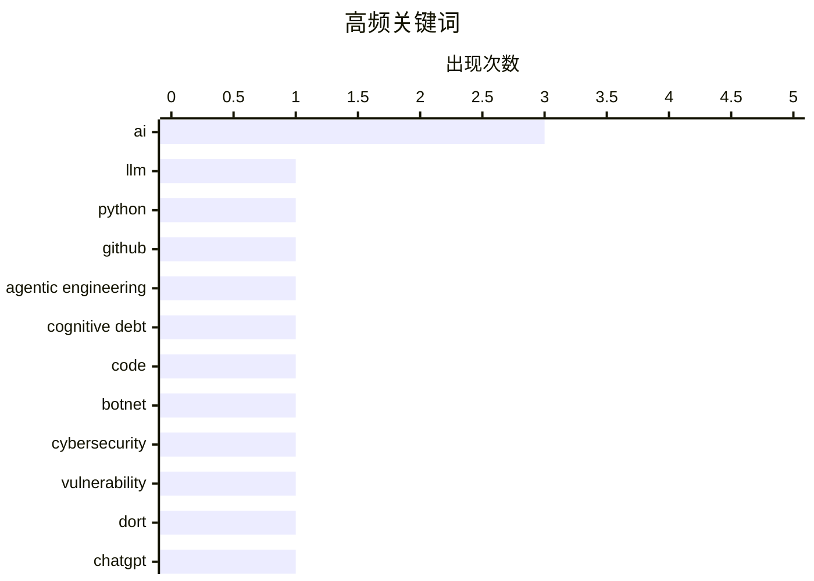

# 📰 AI 博客每日精选 — 2026-03-01

> 来自 Karpathy 推荐的 92 个顶级技术博客，AI 精选 Top 14

## 📝 今日看点

今日技术圈主要关注大型语言模型在代码生成中的应用及其带来的安全和认知债务问题，同时也聚焦于网络安全威胁和数据隐私保护。开源软件和 SaaS 在代码生成技术发展中的新挑战和机遇也成为热议话题。

---

## 🏆 今日必读

🥇 **Python 源代码中的大型语言模型应用**

[LLM Use in the Python Source Code](https://blog.miguelgrinberg.com/post/llm-use-in-the-python-source-code) — miguelgrinberg.com · 9 小时前 · 🤖 AI / ML

> 文章讨论了通过 GitHub 用户名来识别使用大型语言模型（LLM）编写代码的项目。通过阻止 GitHub 上的特定用户（如 Claude），可以在访问相关仓库时显示提示，从而识别依赖 Claude Code 的项目。这种方法可以帮助开发者快速识别和评估代码的来源。作者指出，这种技巧在社交媒体上广泛传播，并提供了具体的操作步骤。

💡 **为什么值得读**: 这篇文章值得读，因为它提供了一个实用的方法来识别和评估使用大型语言模型编写的代码，帮助开发者更好地管理项目依赖。

🏷️ LLM, Python, GitHub, AI

🥈 **互动解释**

[Interactive explanations](https://simonwillison.net/guides/agentic-engineering-patterns/interactive-explanations/#atom-everything) — simonwillison.net · 2 小时前 · ⚙️ 工程

> 文章探讨了代理编写的代码可能带来的认知债务问题。当代码的实现细节复杂时，开发者可能会失去对其工作原理的理解。作者建议通过互动解释来减少这种认知债务，使代码更易于理解和维护。这种方法特别适用于复杂的代码逻辑，如数据库操作和 JSON 输出。

💡 **为什么值得读**: 这篇文章值得读，因为它提出了减少代理编写代码带来的认知债务的有效方法，帮助开发者更好地理解和维护代码。

🏷️ agentic engineering, cognitive debt, code, AI

🥉 **Kimwolf 机器人主控者“Dort”是谁？**

[Who is the Kimwolf Botmaster “Dort”?](https://krebsonsecurity.com/2026/02/who-is-the-kimwolf-botmaster-dort/) — krebsonsecurity.com · 13 小时前 · 🔒 安全

> 文章揭示了 Kimwolf 机器人网络的背后主控者“Dort”的身份。Kimwolf 是全球最大且最具破坏性的机器人网络，通过利用安全漏洞进行分布式拒绝服务（DDoS）攻击、泄露个人信息和电子邮件洪水攻击。作者详细描述了“Dort”对安全研究人员和作者本人的攻击行为，以及相关的法律和安全问题。

💡 **为什么值得读**: 这篇文章值得读，因为它揭示了 Kimwolf 机器人网络的背后操控者及其攻击手段，对网络安全研究和防护具有重要参考价值。

🏷️ botnet, cybersecurity, vulnerability, Dort

---

## 📊 数据概览

| 扫描源 | 抓取文章 | 时间范围 | 精选 |
|:---:|:---:|:---:|:---:|
| 88/92 | 2369 篇 → 14 篇 | 24h | **14 篇** |

### 分类分布


### 高频关键词



<details>
<summary>📈 纯文本关键词图（终端友好）</summary>

```
ai                  │ ████████████████████ 3
llm                 │ ███████░░░░░░░░░░░░░ 1
python              │ ███████░░░░░░░░░░░░░ 1
github              │ ███████░░░░░░░░░░░░░ 1
agentic engineering │ ███████░░░░░░░░░░░░░ 1
cognitive debt      │ ███████░░░░░░░░░░░░░ 1
code                │ ███████░░░░░░░░░░░░░ 1
botnet              │ ███████░░░░░░░░░░░░░ 1
cybersecurity       │ ███████░░░░░░░░░░░░░ 1
vulnerability       │ ███████░░░░░░░░░░░░░ 1
```

</details>

### 🏷️ 话题标签

**ai**(3) · **llm**(1) · **python**(1) · github(1) · agentic engineering(1) · cognitive debt(1) · code(1) · botnet(1) · cybersecurity(1) · vulnerability(1) · dort(1) · chatgpt(1) · ai ethics(1) · mass surveillance(1) · ai deployment(1) · open source(1) · saas(1) · code generation(1) · microservices(1) · architecture(1)

---

## 📝 其他

### 1. 30 个月到 3MWh - 更多家用电池统计数据

[30 months to 3MWh - some more home battery stats](https://shkspr.mobi/blog/2026/02/30-months-to-3mwh-some-more-home-battery-stats/) — **shkspr.mobi** · 12 小时前 · ⭐ 15/30

> 文章分享了 Moixa 4.8kWh 太阳能电池在家庭中的使用情况。作者估计，自安装以来，电池已经节省了约 3 兆瓦时的电能，相当于显著的经济效益。文章详细描述了电池的工作原理和性能数据，帮助读者了解家用电池的实际应用和效果。

🏷️ home battery, solar energy, energy storage

---

### 2. 2026 年 2 月 28 日阅读清单

[Reading List 02/28/26](https://www.construction-physics.com/p/reading-list-022826) — **construction-physics.com** · 11 小时前 · ⭐ 15/30

> 文章列出了 2026 年 2 月 28 日的阅读清单，涵盖了 LA 建筑许可费用、房地产市场、Panasonic 停产电视、无人驾驶汽车远程操作员和地热能进展等多个话题。文章提供了每个话题的简要介绍和相关链接，帮助读者快速了解最新动态。

🏷️ LA permitting, housing, geothermal

---

### 3. Pluralistic: California can stop Larry Ellison from buying Warners (28 Feb 2026)

[Pluralistic: California can stop Larry Ellison from buying Warners (28 Feb 2026)](https://pluralistic.net/2026/02/28/golden-mean/) — **pluralistic.net** · 13 小时前 · ⭐ 12/30

> Today's links California can stop Larry Ellison from buying Warners: These are the right states' rights. Hey look at this: Delights to delectate. Object permanence: RIP Octavia Butler; "Midnighters"; 

🏷️ business, acquisition, Larry Ellison

---

### 4. Approximation game

[Approximation game](https://lcamtuf.substack.com/p/approximation-game) — **lcamtuf.substack.com** · 22 小时前 · ⭐ 12/30

> The number 22/7 and the pigeon flock of Peter Gustav Lejeune Dirichlet.

🏷️ mathematics, approximation, pigeonhole principle

---

### 5. Trump’s Enormous Gamble on Regime Change in Iran

[Trump’s Enormous Gamble on Regime Change in Iran](https://www.theatlantic.com/ideas/2026/02/trumps-iran-regime-change-attack-gamble/686190/?gift=aQyUJR7AIw1mJWdQ6Ed6yOWB4bfod1kQqCyz2RXbHaY) — **daringfireball.net** · 9 小时前 · ⭐ 11/30

> Tom Nichols, writing for The Atlantic:


  When the 2003 war with Iraq ended, U.S. Ambassador Barbara Bodine said that when American diplomats embarked on reconstruction, they ruefully joked that “the

🏷️ politics, Iran, reconstruction

---

### 6. The whole thing was a scam

[The whole thing was a scam](https://garymarcus.substack.com/p/the-whole-thing-was-scam) — **garymarcus.substack.com** · 8 小时前 · ⭐ 9/30

> The fix was in, and Dario never had a chance.

🏷️ scam, ethics, AI

---

## 🤖 AI / ML

### 7. Python 源代码中的大型语言模型应用

[LLM Use in the Python Source Code](https://blog.miguelgrinberg.com/post/llm-use-in-the-python-source-code) — **miguelgrinberg.com** · 9 小时前 · ⭐ 26/30

> 文章讨论了通过 GitHub 用户名来识别使用大型语言模型（LLM）编写代码的项目。通过阻止 GitHub 上的特定用户（如 Claude），可以在访问相关仓库时显示提示，从而识别依赖 Claude Code 的项目。这种方法可以帮助开发者快速识别和评估代码的来源。作者指出，这种技巧在社交媒体上广泛传播，并提供了具体的操作步骤。

🏷️ LLM, Python, GitHub, AI

---

### 8. 我要取消我的 ChatGPT 账户

[That's it, I'm cancelling my ChatGPT](https://idiallo.com/byte-size/im-cancelling-my-chatgpt-openai-account?src=feed) — **idiallo.com** · 7 小时前 · ⭐ 23/30

> 文章讨论了 ChatGPT 可能被用于大规模监控和武器部署的问题。作者引用了 Sam Altman 的推文，指出 ChatGPT 可能被用于军事目的，并批评 Anthropic 的 CEO 拒绝与国防部合作。文章强调了大规模监控的风险和技术的潜在滥用。

🏷️ ChatGPT, AI ethics, mass surveillance, AI deployment

---

## 🔒 安全

### 9. Kimwolf 机器人主控者“Dort”是谁？

[Who is the Kimwolf Botmaster “Dort”?](https://krebsonsecurity.com/2026/02/who-is-the-kimwolf-botmaster-dort/) — **krebsonsecurity.com** · 13 小时前 · ⭐ 24/30

> 文章揭示了 Kimwolf 机器人网络的背后主控者“Dort”的身份。Kimwolf 是全球最大且最具破坏性的机器人网络，通过利用安全漏洞进行分布式拒绝服务（DDoS）攻击、泄露个人信息和电子邮件洪水攻击。作者详细描述了“Dort”对安全研究人员和作者本人的攻击行为，以及相关的法律和安全问题。

🏷️ botnet, cybersecurity, vulnerability, Dort

---

### 10. npm 数据主体访问请求

[npm Data Subject Access Request](https://nesbitt.io/2026/02/28/npm-data-subject-access-request.html) — **nesbitt.io** · 15 小时前 · ⭐ 16/30

> 文章回应了 GDPR 数据主体访问请求，详细描述了如何处理用户数据请求。作者强调了数据隐私和安全的重要性，并提供了具体的操作步骤和技术细节，帮助读者理解和遵守 GDPR 规定。

🏷️ GDPR, data privacy, npm

---

## 🛠 工具 / 开源

### 11. 开源、SaaS 以及无限代码生成后的沉默

[Open Source, SaaS, and the Silence After Unlimited Code Generation](https://worksonmymachine.ai/p/open-source-saas-and-the-silence) — **worksonmymachine.substack.com** · 10 小时前 · ⭐ 23/30

> 文章探讨了开源软件和 SaaS（软件即服务）在无限代码生成后的现状。作者指出，随着代码生成技术的发展，开源社区和 SaaS 提供商面临新的挑战和机遇。文章讨论了代码生成对开发者和用户的影响，以及未来可能的发展方向。

🏷️ open source, SaaS, code generation

---

### 12. 在 Bash 脚本中处理文件扩展名

[Working with file extensions in bash scripts](https://www.johndcook.com/blog/2026/02/28/file-extensions-bash/) — **johndcook.com** · 6 小时前 · ⭐ 19/30

> 文章介绍了在 Bash 脚本中处理文件扩展名的技巧。作者指出，虽然 Bash 脚本编写相对简单，但某些特定功能可以通过简洁的命令实现。文章提供了具体的代码示例和技术细节，帮助读者更好地理解和使用 Bash 脚本。

🏷️ bash scripting, file extensions, shell scripting

---

## ⚙️ 工程

### 13. 互动解释

[Interactive explanations](https://simonwillison.net/guides/agentic-engineering-patterns/interactive-explanations/#atom-everything) — **simonwillison.net** · 2 小时前 · ⭐ 24/30

> 文章探讨了代理编写的代码可能带来的认知债务问题。当代码的实现细节复杂时，开发者可能会失去对其工作原理的理解。作者建议通过互动解释来减少这种认知债务，使代码更易于理解和维护。这种方法特别适用于复杂的代码逻辑，如数据库操作和 JSON 输出。

🏷️ agentic engineering, cognitive debt, code, AI

---

## 💡 观点 / 杂谈

### 14. 最重要的微服务

[The Most Important Micros](https://www.abortretry.fail/p/the-most-important-micros) — **abortretry.fail** · 6 小时前 · ⭐ 20/30

> 文章讨论了微服务架构中最重要的微服务及其代表的意义。作者强调了这些微服务在系统设计和开发中的关键作用，并探讨了它们对系统性能和可维护性的影响。文章提供了具体的案例和技术细节，帮助读者理解微服务架构的核心概念。

🏷️ microservices, architecture, design

---

*生成于 2026-03-01 01:11 | 扫描 88 源 → 获取 2369 篇 → 精选 14 篇*
*基于 [Hacker News Popularity Contest 2025](https://refactoringenglish.com/tools/hn-popularity/) RSS 源列表，由 [Andrej Karpathy](https://x.com/karpathy) 推荐*
*由「懂点儿AI」制作，欢迎关注同名微信公众号获取更多 AI 实用技巧 💡*
