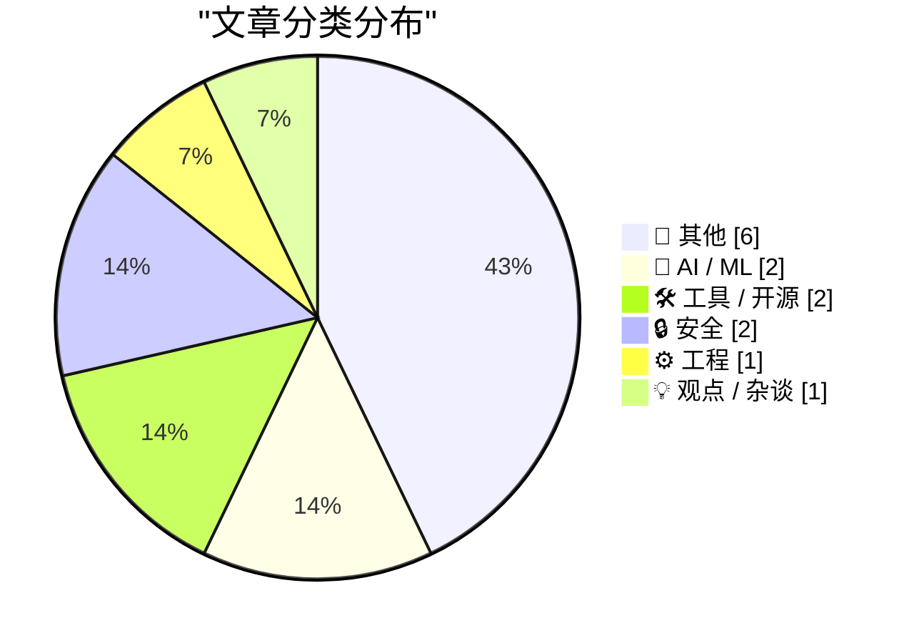
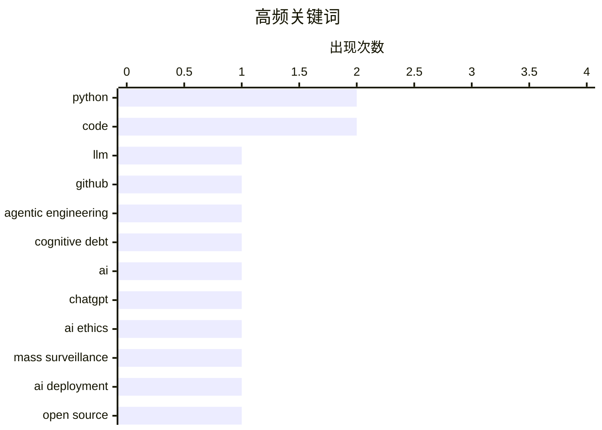

# 📰 AI 博客每日精选 — 2026-03-01

> 来自 Karpathy 推荐的 92 个顶级技术博客，AI 精选 Top 14

## 📝 今日看点

今日技术圈聚焦于人工智能应用与安全问题。大语言模型在编程领域的应用引发广泛讨论，同时开源与SaaS模式的碰撞也成为热点话题。此外，网络安全领域的新动态，如Botmaster的身份揭秘和npm数据访问请求，也备受关注。

---

## 🏆 今日必读

🥇 **LLM Use in the Python Source Code**

[LLM Use in the Python Source Code](https://blog.miguelgrinberg.com/post/llm-use-in-the-python-source-code) — miguelgrinberg.com · 9 小时前 · 🤖 AI / ML

> LLM Use in the Python Source Code

🏷️ LLM, Python, GitHub, code

🥈 **Interactive explanations**

[Interactive explanations](https://simonwillison.net/guides/agentic-engineering-patterns/interactive-explanations/#atom-everything) — simonwillison.net · 1 小时前 · ⚙️ 工程

> Interactive explanations

🏷️ agentic engineering, cognitive debt, code, AI

🥉 **That's it, I'm cancelling my ChatGPT**

[That's it, I'm cancelling my ChatGPT](https://idiallo.com/byte-size/im-cancelling-my-chatgpt-openai-account?src=feed) — idiallo.com · 6 小时前 · 🤖 AI / ML

> That's it, I'm cancelling my ChatGPT

🏷️ ChatGPT, AI ethics, mass surveillance, AI deployment

---

## 📊 数据概览

| 扫描源 | 抓取文章 | 时间范围 | 精选 |
|:---:|:---:|:---:|:---:|
| 88/92 | 2369 篇 → 14 篇 | 24h | **14 篇** |

### 分类分布



### 高频关键词



<details>
<summary>📈 纯文本关键词图（终端友好）</summary>

```
python              │ ████████████████████ 2
code                │ ████████████████████ 2
llm                 │ ██████████░░░░░░░░░░ 1
github              │ ██████████░░░░░░░░░░ 1
agentic engineering │ ██████████░░░░░░░░░░ 1
cognitive debt      │ ██████████░░░░░░░░░░ 1
ai                  │ ██████████░░░░░░░░░░ 1
chatgpt             │ ██████████░░░░░░░░░░ 1
ai ethics           │ ██████████░░░░░░░░░░ 1
mass surveillance   │ ██████████░░░░░░░░░░ 1
```

</details>

### 🏷️ 话题标签

**python**(2) · **code**(2) · **llm**(1) · github(1) · agentic engineering(1) · cognitive debt(1) · ai(1) · chatgpt(1) · ai ethics(1) · mass surveillance(1) · ai deployment(1) · open source(1) · saas(1) · code generation(1) · bash scripting(1) · file extensions(1) · shell scripting(1) · botnet(1) · cybersecurity(1) · vulnerability(1)

---

## 📝 其他

### 1. 30 months to 3MWh - some more home battery stats

[30 months to 3MWh - some more home battery stats](https://shkspr.mobi/blog/2026/02/30-months-to-3mwh-some-more-home-battery-stats/) — **shkspr.mobi** · 11 小时前 · ⭐ 15/30

> 30 months to 3MWh - some more home battery stats

🏷️ home battery, solar energy, energy storage, renewable energy

---

### 2. Reading List 02/28/26

[Reading List 02/28/26](https://www.construction-physics.com/p/reading-list-022826) — **construction-physics.com** · 10 小时前 · ⭐ 15/30

> Reading List 02/28/26

🏷️ LA permitting, housing, geothermal

---

### 3. Approximation game

[Approximation game](https://lcamtuf.substack.com/p/approximation-game) — **lcamtuf.substack.com** · 21 小时前 · ⭐ 12/30

> The number 22/7 and the pigeon flock of Peter Gustav Lejeune Dirichlet.

🏷️ mathematics, approximation, Dirichlet

---

### 4. Trump’s Enormous Gamble on Regime Change in Iran

[Trump’s Enormous Gamble on Regime Change in Iran](https://www.theatlantic.com/ideas/2026/02/trumps-iran-regime-change-attack-gamble/686190/?gift=aQyUJR7AIw1mJWdQ6Ed6yOWB4bfod1kQqCyz2RXbHaY) — **daringfireball.net** · 8 小时前 · ⭐ 9/30

> Tom Nichols, writing for The Atlantic:


  When the 2003 war with Iraq ended, U.S. Ambassador Barbara Bodine said that when American diplomats embarked on reconstruction, they ruefully joked that “the

🏷️ politics, Iran, reconstruction

---

### 5. Pluralistic: California can stop Larry Ellison from buying Warners (28 Feb 2026)

[Pluralistic: California can stop Larry Ellison from buying Warners (28 Feb 2026)](https://pluralistic.net/2026/02/28/golden-mean/) — **pluralistic.net** · 13 小时前 · ⭐ 9/30

> Today's links California can stop Larry Ellison from buying Warners: These are the right states' rights. Hey look at this: Delights to delectate. Object permanence: RIP Octavia Butler; "Midnighters"; 

🏷️ business, media, Larry Ellison, Warners

---

### 6. The whole thing was a scam

[The whole thing was a scam](https://garymarcus.substack.com/p/the-whole-thing-was-scam) — **garymarcus.substack.com** · 7 小时前 · ⭐ 8/30

> The fix was in, and Dario never had a chance.

🏷️ scam, Dario, fraud

---

## 🤖 AI / ML

### 7. LLM Use in the Python Source Code

[LLM Use in the Python Source Code](https://blog.miguelgrinberg.com/post/llm-use-in-the-python-source-code) — **miguelgrinberg.com** · 9 小时前 · ⭐ 25/30

> LLM Use in the Python Source Code

🏷️ LLM, Python, GitHub, code

---

### 8. That's it, I'm cancelling my ChatGPT

[That's it, I'm cancelling my ChatGPT](https://idiallo.com/byte-size/im-cancelling-my-chatgpt-openai-account?src=feed) — **idiallo.com** · 6 小时前 · ⭐ 23/30

> That's it, I'm cancelling my ChatGPT

🏷️ ChatGPT, AI ethics, mass surveillance, AI deployment

---

## 🛠 工具 / 开源

### 9. Open Source, SaaS, and the Silence After Unlimited Code Generation

[Open Source, SaaS, and the Silence After Unlimited Code Generation](https://worksonmymachine.ai/p/open-source-saas-and-the-silence) — **worksonmymachine.substack.com** · 9 小时前 · ⭐ 23/30

> Open Source, SaaS, and the Silence After Unlimited Code Generation

🏷️ open source, SaaS, code generation

---

### 10. Working with file extensions in bash scripts

[Working with file extensions in bash scripts](https://www.johndcook.com/blog/2026/02/28/file-extensions-bash/) — **johndcook.com** · 5 小时前 · ⭐ 19/30

> Working with file extensions in bash scripts

🏷️ bash scripting, file extensions, shell scripting, Python

---

## 🔒 安全

### 11. Who is the Kimwolf Botmaster “Dort”?

[Who is the Kimwolf Botmaster “Dort”?](https://krebsonsecurity.com/2026/02/who-is-the-kimwolf-botmaster-dort/) — **krebsonsecurity.com** · 12 小时前 · ⭐ 18/30

> Who is the Kimwolf Botmaster “Dort”?

🏷️ botnet, cybersecurity, vulnerability, Dort

---

### 12. npm Data Subject Access Request

[npm Data Subject Access Request](https://nesbitt.io/2026/02/28/npm-data-subject-access-request.html) — **nesbitt.io** · 14 小时前 · ⭐ 16/30

> npm Data Subject Access Request

🏷️ GDPR, data access, privacy, npm

---

## ⚙️ 工程

### 13. Interactive explanations

[Interactive explanations](https://simonwillison.net/guides/agentic-engineering-patterns/interactive-explanations/#atom-everything) — **simonwillison.net** · 1 小时前 · ⭐ 24/30

> Interactive explanations

🏷️ agentic engineering, cognitive debt, code, AI

---

## 💡 观点 / 杂谈

### 14. The Most Important Micros

[The Most Important Micros](https://www.abortretry.fail/p/the-most-important-micros) — **abortretry.fail** · 5 小时前 · ⭐ 18/30

> The Most Important Micros

🏷️ microservices, architecture, design

---

*生成于 2026-03-01 00:19 | 扫描 88 源 → 获取 2369 篇 → 精选 14 篇*
*基于 [Hacker News Popularity Contest 2025](https://refactoringenglish.com/tools/hn-popularity/) RSS 源列表，由 [Andrej Karpathy](https://x.com/karpathy) 推荐*
*由「懂点儿AI」制作，欢迎关注同名微信公众号获取更多 AI 实用技巧 💡*
