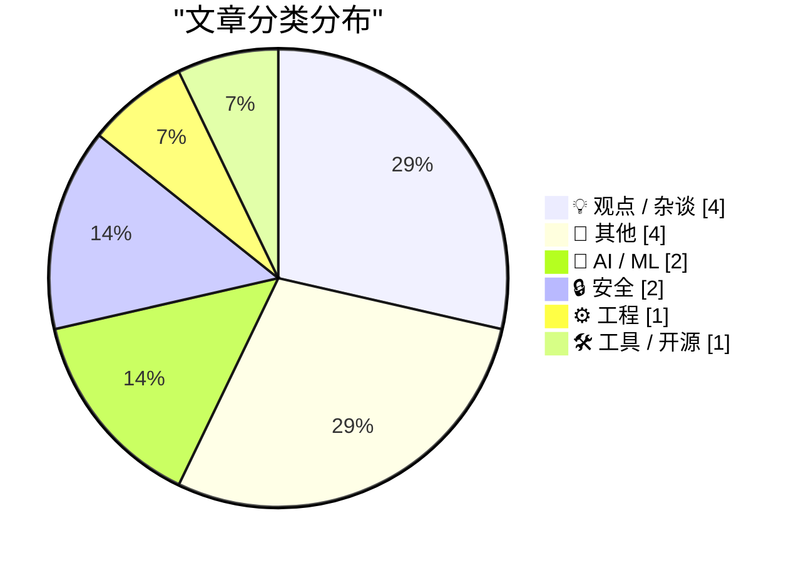
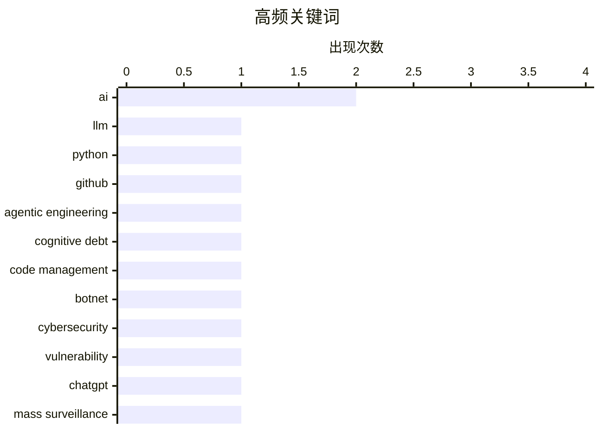

# 📰 AI 博客每日精选 — 2026-03-01

> 来自 Karpathy 推荐的 92 个顶级技术博客，AI 精选 Top 14

## 📝 今日看点

今日看点：技术圈关注大语言模型在代码中的应用及其潜在风险，安全领域揭露了 Kimwolf 机器人网络的主控者身份，同时讨论了微处理器在现代技术中的核心地位。

---

## 🏆 今日必读

🥇 **Python 源代码中大语言模型的使用**

[LLM Use in the Python Source Code](https://blog.miguelgrinberg.com/post/llm-use-in-the-python-source-code) — miguelgrinberg.com · 9 小时前 · 🤖 AI / ML

> 文章讨论了大语言模型在 Python 源代码中的应用。通过在 GitHub 上屏蔽特定用户（如 Claude），可以识别出依赖于 Claude Code 的项目。这种方法可以帮助开发者快速发现和管理代码中使用的 AI 辅助工具。作者建议这种技术可以提高代码的可追踪性和安全性。

💡 **为什么值得读**: 了解如何利用 GitHub 识别和管理 AI 辅助编码工具，提升代码管理效率。

🏷️ LLM, Python, GitHub, AI

🥈 **交互式解释**

[Interactive explanations](https://simonwillison.net/guides/agentic-engineering-patterns/interactive-explanations/#atom-everything) — simonwillison.net · 1 小时前 · ⚙️ 工程

> 文章探讨了代理编写代码时可能带来的认知债务问题。当代码的实现细节复杂时，开发者可能会失去对代码的理解。作者提出了交互式解释的概念，以帮助开发者更好地理解和维护代码。这种方法可以减少认知债务，提高代码的可维护性。

💡 **为什么值得读**: 了解如何通过交互式解释减少代理编写代码带来的认知债务，提升代码维护效率。

🏷️ agentic engineering, cognitive debt, code management

🥉 **Kimwolf 机器人主控者“Dort”是谁？**

[Who is the Kimwolf Botmaster “Dort”?](https://krebsonsecurity.com/2026/02/who-is-the-kimwolf-botmaster-dort/) — krebsonsecurity.com · 12 小时前 · 🔒 安全

> 文章揭示了 Kimwolf 机器人网络的主控者“Dort”的身份，该网络是全球最大且最具破坏性的。Dort 利用 Kimwolf 发动了多次 DDoS 攻击、泄露个人信息和电子邮件洪水攻击。文章还提到，Dort 最近导致了一次 SWAT 团队的误报警事件。

💡 **为什么值得读**: 了解 Kimwolf 机器人网络的背后操控者及其攻击手段，增强网络安全意识。

🏷️ botnet, cybersecurity, vulnerability

---

## 📊 数据概览

| 扫描源 | 抓取文章 | 时间范围 | 精选 |
|:---:|:---:|:---:|:---:|
| 88/92 | 2369 篇 → 14 篇 | 24h | **14 篇** |

### 分类分布



### 高频关键词



<details>
<summary>📈 纯文本关键词图（终端友好）</summary>

```
ai                  │ ████████████████████ 2
llm                 │ ██████████░░░░░░░░░░ 1
python              │ ██████████░░░░░░░░░░ 1
github              │ ██████████░░░░░░░░░░ 1
agentic engineering │ ██████████░░░░░░░░░░ 1
cognitive debt      │ ██████████░░░░░░░░░░ 1
code management     │ ██████████░░░░░░░░░░ 1
botnet              │ ██████████░░░░░░░░░░ 1
cybersecurity       │ ██████████░░░░░░░░░░ 1
vulnerability       │ ██████████░░░░░░░░░░ 1
```

</details>

### 🏷️ 话题标签

**ai**(2) · **llm**(1) · **python**(1) · github(1) · agentic engineering(1) · cognitive debt(1) · code management(1) · botnet(1) · cybersecurity(1) · vulnerability(1) · chatgpt(1) · mass surveillance(1) · ai ethics(1) · open source(1) · saas(1) · code generation(1) · bash scripting(1) · file extensions(1) · shell scripting(1) · microservices(1)

---

## 💡 观点 / 杂谈

### 1. 开源、SaaS 以及无限代码生成后的沉默

[Open Source, SaaS, and the Silence After Unlimited Code Generation](https://worksonmymachine.ai/p/open-source-saas-and-the-silence) — **worksonmymachine.substack.com** · 9 小时前 · ⭐ 23/30

> 文章探讨了开源和 SaaS 模式在无限代码生成后的变化。作者指出，随着代码生成技术的发展，反馈机制可能会减弱，影响开源社区的活跃度和 SaaS 服务的用户体验。

🏷️ open source, SaaS, AI, code generation

---

### 2. 最重要的微处理器

[The Most Important Micros](https://www.abortretry.fail/p/the-most-important-micros) — **abortretry.fail** · 5 小时前 · ⭐ 18/30

> 文章讨论了微处理器在现代技术中的重要性。作者强调，微处理器不仅是硬件的核心组件，还代表了技术进步的方向。文章探讨了微处理器在不同领域的应用和未来发展趋势。

🏷️ microservices, architecture, design

---

### 3. Pluralistic: California can stop Larry Ellison from buying Warners (28 Feb 2026)

[Pluralistic: California can stop Larry Ellison from buying Warners (28 Feb 2026)](https://pluralistic.net/2026/02/28/golden-mean/) — **pluralistic.net** · 13 小时前 · ⭐ 13/30

> Today's links California can stop Larry Ellison from buying Warners: These are the right states' rights. Hey look at this: Delights to delectate. Object permanence: RIP Octavia Butler; "Midnighters"; 

🏷️ corporate acquisitions, tech industry

---

### 4. The whole thing was a scam

[The whole thing was a scam](https://garymarcus.substack.com/p/the-whole-thing-was-scam) — **garymarcus.substack.com** · 7 小时前 · ⭐ 9/30

> The fix was in, and Dario never had a chance.

🏷️ scam, ethics

---

## 📝 其他

### 5. 30 个月到 3MWh - 更多家庭电池统计数据

[30 months to 3MWh - some more home battery stats](https://shkspr.mobi/blog/2026/02/30-months-to-3mwh-some-more-home-battery-stats/) — **shkspr.mobi** · 11 小时前 · ⭐ 15/30

> 文章分享了 Moixa 4.8kWh 太阳能电池在家庭中的使用情况。自 2023 年 8 月安装以来，该电池已累计储存和释放约 3 兆瓦时的电能，节省了大量电费。作者还提供了具体的统计数据和使用体验，帮助读者了解太阳能电池的实际效果。

🏷️ home battery, solar energy

---

### 6. 2026 年 2 月 28 日阅读清单

[Reading List 02/28/26](https://www.construction-physics.com/p/reading-list-022826) — **construction-physics.com** · 10 小时前 · ⭐ 15/30

> 文章列出了 2026 年 2 月 28 日的阅读清单，涵盖了 LA 建筑许可费用、房地产市场、Panasonic 停产电视、自动驾驶汽车远程操作员和地热能进展等话题。文章提供了丰富的资讯和见解，帮助读者了解最新的行业动态。

🏷️ LA permitting, housing, geothermal

---

### 7. Approximation game

[Approximation game](https://lcamtuf.substack.com/p/approximation-game) — **lcamtuf.substack.com** · 21 小时前 · ⭐ 12/30

> The number 22/7 and the pigeon flock of Peter Gustav Lejeune Dirichlet.

🏷️ mathematics, approximation

---

### 8. Trump’s Enormous Gamble on Regime Change in Iran

[Trump’s Enormous Gamble on Regime Change in Iran](https://www.theatlantic.com/ideas/2026/02/trumps-iran-regime-change-attack-gamble/686190/?gift=aQyUJR7AIw1mJWdQ6Ed6yOWB4bfod1kQqCyz2RXbHaY) — **daringfireball.net** · 8 小时前 · ⭐ 10/30

> Tom Nichols, writing for The Atlantic:


  When the 2003 war with Iraq ended, U.S. Ambassador Barbara Bodine said that when American diplomats embarked on reconstruction, they ruefully joked that “the

🏷️ politics, international relations

---

## 🤖 AI / ML

### 9. Python 源代码中大语言模型的使用

[LLM Use in the Python Source Code](https://blog.miguelgrinberg.com/post/llm-use-in-the-python-source-code) — **miguelgrinberg.com** · 9 小时前 · ⭐ 25/30

> 文章讨论了大语言模型在 Python 源代码中的应用。通过在 GitHub 上屏蔽特定用户（如 Claude），可以识别出依赖于 Claude Code 的项目。这种方法可以帮助开发者快速发现和管理代码中使用的 AI 辅助工具。作者建议这种技术可以提高代码的可追踪性和安全性。

🏷️ LLM, Python, GitHub, AI

---

### 10. 取消我的 ChatGPT 账户

[That's it, I'm cancelling my ChatGPT](https://idiallo.com/byte-size/im-cancelling-my-chatgpt-openai-account?src=feed) — **idiallo.com** · 6 小时前 · ⭐ 24/30

> 文章讨论了 ChatGPT 可能被用于大规模监控和武器部署的问题。作者指出，ChatGPT 的技术可能成为大规模监控的关键驱动力。Anthropic 的 CEO 也公开拒绝与国防部合作，表明对技术滥用的担忧。

🏷️ ChatGPT, mass surveillance, AI ethics

---

## 🔒 安全

### 11. Kimwolf 机器人主控者“Dort”是谁？

[Who is the Kimwolf Botmaster “Dort”?](https://krebsonsecurity.com/2026/02/who-is-the-kimwolf-botmaster-dort/) — **krebsonsecurity.com** · 12 小时前 · ⭐ 24/30

> 文章揭示了 Kimwolf 机器人网络的主控者“Dort”的身份，该网络是全球最大且最具破坏性的。Dort 利用 Kimwolf 发动了多次 DDoS 攻击、泄露个人信息和电子邮件洪水攻击。文章还提到，Dort 最近导致了一次 SWAT 团队的误报警事件。

🏷️ botnet, cybersecurity, vulnerability

---

### 12. npm 数据主体访问请求

[npm Data Subject Access Request](https://nesbitt.io/2026/02/28/npm-data-subject-access-request.html) — **nesbitt.io** · 14 小时前 · ⭐ 16/30

> 文章回应了 GDPR 数据主体访问请求。作者详细描述了如何处理用户的数据访问请求，确保数据隐私和合规性。文章还提供了具体的操作步骤和注意事项，帮助开发者更好地应对类似请求。

🏷️ GDPR, data privacy, npm

---

## ⚙️ 工程

### 13. 交互式解释

[Interactive explanations](https://simonwillison.net/guides/agentic-engineering-patterns/interactive-explanations/#atom-everything) — **simonwillison.net** · 1 小时前 · ⭐ 24/30

> 文章探讨了代理编写代码时可能带来的认知债务问题。当代码的实现细节复杂时，开发者可能会失去对代码的理解。作者提出了交互式解释的概念，以帮助开发者更好地理解和维护代码。这种方法可以减少认知债务，提高代码的可维护性。

🏷️ agentic engineering, cognitive debt, code management

---

## 🛠 工具 / 开源

### 14. 在 Bash 脚本中处理文件扩展名

[Working with file extensions in bash scripts](https://www.johndcook.com/blog/2026/02/28/file-extensions-bash/) — **johndcook.com** · 5 小时前 · ⭐ 20/30

> 文章介绍了在 Bash 脚本中处理文件扩展名的方法。作者指出，虽然 Bash 脚本编写相对简单，但某些特定功能可以通过 Bash 实现得更加简洁和高效。文章提供了具体的代码示例，帮助读者更好地理解和应用这些技巧。

🏷️ bash scripting, file extensions, shell scripting

---

*生成于 2026-03-01 00:15 | 扫描 88 源 → 获取 2369 篇 → 精选 14 篇*
*基于 [Hacker News Popularity Contest 2025](https://refactoringenglish.com/tools/hn-popularity/) RSS 源列表，由 [Andrej Karpathy](https://x.com/karpathy) 推荐*
*由「懂点儿AI」制作，欢迎关注同名微信公众号获取更多 AI 实用技巧 💡*
