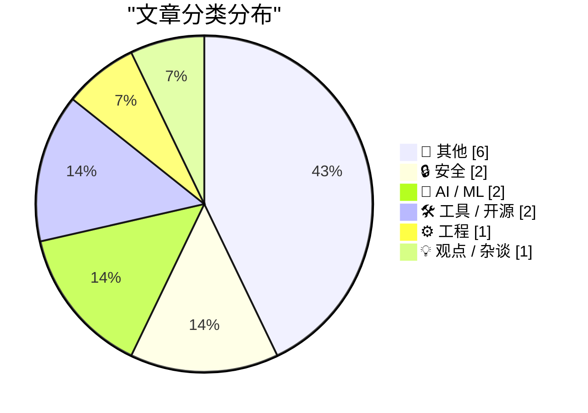
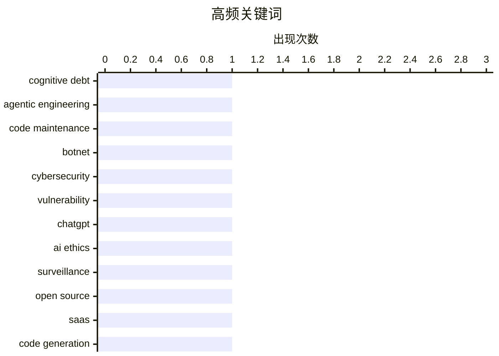

# 📰 AI 博客每日精选 — 2026-03-01

> 来自 Karpathy 推荐的 92 个顶级技术博客，AI 精选 Top 14

## 📝 今日看点

今日看点：技术圈热议焦点集中在代码生成与安全问题。随着代码生成技术的快速发展，开源社区和SaaS提供商面临新的挑战和机遇，而网络安全威胁也日益严峻，机器人网络和数据隐私保护成为关注重点。此外，微型芯片在现代技术中的重要性不断凸显，推动物联网和人工智能等领域的进步。

---

## 🏆 今日必读

🥇 **交互式解释**

[Interactive explanations](https://simonwillison.net/guides/agentic-engineering-patterns/interactive-explanations/#atom-everything) — simonwillison.net · 1 小时前 · ⚙️ 工程

> 代理编写的代码可能导致认知债务，使得我们难以理解其工作原理。对于简单的数据处理任务，实现细节通常不重要。然而，对于复杂的代码，交互式解释可以帮助我们理解代码的工作原理，从而减少认知债务。通过交互式解释，开发者可以更直观地调试和优化代码。作者认为，交互式解释是提高代码可维护性和可理解性的有效方法。

💡 **为什么值得读**: 了解如何通过交互式解释减少代理编写代码带来的认知债务，提升代码的可维护性和可理解性。

🏷️ cognitive debt, agentic engineering, code maintenance

🥈 **Kimwolf 机器人主管“Dort”是谁？**

[Who is the Kimwolf Botmaster “Dort”?](https://krebsonsecurity.com/2026/02/who-is-the-kimwolf-botmaster-dort/) — krebsonsecurity.com · 12 小时前 · 🔒 安全

> Kimwolf 是全球最大且最具破坏性的机器人网络，由“Dort”控制。自 2026 年 1 月以来，Dort 发起了多次 DDoS 攻击、泄露个人信息和电子邮件洪水攻击，甚至导致 SWAT 突击队前往研究人员的住所。文章分析了 Kimwolf 的攻击模式和背后的技术手段，揭示了其对网络安全的严重威胁。作者强调了需要加强网络安全防护措施，以应对类似的高级持续性威胁。

💡 **为什么值得读**: 了解 Kimwolf 机器人网络的攻击手段和防护措施，提升网络安全意识和应对能力。

🏷️ botnet, cybersecurity, vulnerability

🥉 **我要取消我的 ChatGPT 账户**

[That's it, I'm cancelling my ChatGPT](https://idiallo.com/byte-size/im-cancelling-my-chatgpt-openai-account?src=feed) — idiallo.com · 6 小时前 · 🤖 AI / ML

> ChatGPT 的创始人 Sam Altman 加入所谓的“战争部”，将 ChatGPT 用于分类网络，引发了大规模监控和武器部署的担忧。Anthropic 的 CEO 也公开拒绝与“战争部”合作。作者认为，ChatGPT 可能成为大规模监控的工具，呼吁用户警惕其潜在风险。作者决定取消 ChatGPT 账户，以表达对隐私和安全的关注。

💡 **为什么值得读**: 了解 ChatGPT 在大规模监控和武器部署中的潜在风险，保护个人隐私和安全。

🏷️ ChatGPT, AI ethics, surveillance

---

## 📊 数据概览

| 扫描源 | 抓取文章 | 时间范围 | 精选 |
|:---:|:---:|:---:|:---:|
| 88/92 | 2369 篇 → 14 篇 | 24h | **14 篇** |

### 分类分布



### 高频关键词



<details>
<summary>📈 纯文本关键词图（终端友好）</summary>

```
cognitive debt      │ ████████████████████ 1
agentic engineering │ ████████████████████ 1
code maintenance    │ ████████████████████ 1
botnet              │ ████████████████████ 1
cybersecurity       │ ████████████████████ 1
vulnerability       │ ████████████████████ 1
chatgpt             │ ████████████████████ 1
ai ethics           │ ████████████████████ 1
surveillance        │ ████████████████████ 1
open source         │ ████████████████████ 1
```

</details>

### 🏷️ 话题标签

**cognitive debt**(1) · **agentic engineering**(1) · **code maintenance**(1) · botnet(1) · cybersecurity(1) · vulnerability(1) · chatgpt(1) · ai ethics(1) · surveillance(1) · open source(1) · saas(1) · code generation(1) · llm(1) · python(1) · github(1) · social media(1) · bash scripting(1) · file extensions(1) · microservices(1) · architecture(1)

---

## 📝 其他

### 1. 30 个月到 3MWh - 更多家庭电池统计数据

[30 months to 3MWh - some more home battery stats](https://shkspr.mobi/blog/2026/02/30-months-to-3mwh-some-more-home-battery-stats/) — **shkspr.mobi** · 11 小时前 · ⭐ 15/30

> 文章介绍了 Moixa 4.8kWh 太阳能电池在家庭中的应用，并提供了详细的统计数据。自 2023 年 8 月安装以来，该电池已储存约 3 兆瓦时的电能，节省了大量电费。作者分析了电池的性能和效益，认为太阳能电池在家庭能源管理中具有重要作用。作者建议更多家庭采用太阳能电池，以实现能源自给自足。

🏷️ home battery, solar energy

---

### 2. 2026 年 2 月 28 日阅读清单

[Reading List 02/28/26](https://www.construction-physics.com/p/reading-list-022826) — **construction-physics.com** · 10 小时前 · ⭐ 15/30

> 文章列出了 2026 年 2 月 28 日的阅读清单，涵盖了 LA 许可成本、滴滴房屋、Panasonic 停止生产电视、机器人出租车远程操作员和地热进展等话题。作者分析了这些话题的背景和影响，提供了丰富的信息和见解。通过阅读这些文章，读者可以更好地了解当前的技术和社会趋势。作者认为，这些话题对未来的发展具有重要意义。

🏷️ LA permitting, housing, geothermal

---

### 3. Pluralistic: California can stop Larry Ellison from buying Warners (28 Feb 2026)

[Pluralistic: California can stop Larry Ellison from buying Warners (28 Feb 2026)](https://pluralistic.net/2026/02/28/golden-mean/) — **pluralistic.net** · 13 小时前 · ⭐ 12/30

> Today's links California can stop Larry Ellison from buying Warners: These are the right states' rights. Hey look at this: Delights to delectate. Object permanence: RIP Octavia Butler; "Midnighters"; 

🏷️ business, media

---

### 4. Approximation game

[Approximation game](https://lcamtuf.substack.com/p/approximation-game) — **lcamtuf.substack.com** · 21 小时前 · ⭐ 12/30

> The number 22/7 and the pigeon flock of Peter Gustav Lejeune Dirichlet.

🏷️ mathematics, approximation

---

### 5. Trump’s Enormous Gamble on Regime Change in Iran

[Trump’s Enormous Gamble on Regime Change in Iran](https://www.theatlantic.com/ideas/2026/02/trumps-iran-regime-change-attack-gamble/686190/?gift=aQyUJR7AIw1mJWdQ6Ed6yOWB4bfod1kQqCyz2RXbHaY) — **daringfireball.net** · 8 小时前 · ⭐ 11/30

> Tom Nichols, writing for The Atlantic:


  When the 2003 war with Iraq ended, U.S. Ambassador Barbara Bodine said that when American diplomats embarked on reconstruction, they ruefully joked that “the

🏷️ politics, Iran

---

### 6. The whole thing was a scam

[The whole thing was a scam](https://garymarcus.substack.com/p/the-whole-thing-was-scam) — **garymarcus.substack.com** · 7 小时前 · ⭐ 9/30

> The fix was in, and Dario never had a chance.

🏷️ scam, ethics

---

## 🔒 安全

### 7. Kimwolf 机器人主管“Dort”是谁？

[Who is the Kimwolf Botmaster “Dort”?](https://krebsonsecurity.com/2026/02/who-is-the-kimwolf-botmaster-dort/) — **krebsonsecurity.com** · 12 小时前 · ⭐ 24/30

> Kimwolf 是全球最大且最具破坏性的机器人网络，由“Dort”控制。自 2026 年 1 月以来，Dort 发起了多次 DDoS 攻击、泄露个人信息和电子邮件洪水攻击，甚至导致 SWAT 突击队前往研究人员的住所。文章分析了 Kimwolf 的攻击模式和背后的技术手段，揭示了其对网络安全的严重威胁。作者强调了需要加强网络安全防护措施，以应对类似的高级持续性威胁。

🏷️ botnet, cybersecurity, vulnerability

---

### 8. npm 数据主体访问请求

[npm Data Subject Access Request](https://nesbitt.io/2026/02/28/npm-data-subject-access-request.html) — **nesbitt.io** · 14 小时前 · ⭐ 16/30

> 文章回应了 GDPR 数据主体访问请求，详细说明了如何处理用户数据的访问和删除请求。作者强调了数据隐私和安全的重要性，并提供了具体的操作步骤。通过了解这些步骤，开发者可以更好地遵守 GDPR 规定，保护用户数据。作者认为，数据隐私是现代软件开发中不可忽视的重要问题。

🏷️ GDPR, data privacy

---

## 🤖 AI / ML

### 9. 我要取消我的 ChatGPT 账户

[That's it, I'm cancelling my ChatGPT](https://idiallo.com/byte-size/im-cancelling-my-chatgpt-openai-account?src=feed) — **idiallo.com** · 6 小时前 · ⭐ 24/30

> ChatGPT 的创始人 Sam Altman 加入所谓的“战争部”，将 ChatGPT 用于分类网络，引发了大规模监控和武器部署的担忧。Anthropic 的 CEO 也公开拒绝与“战争部”合作。作者认为，ChatGPT 可能成为大规模监控的工具，呼吁用户警惕其潜在风险。作者决定取消 ChatGPT 账户，以表达对隐私和安全的关注。

🏷️ ChatGPT, AI ethics, surveillance

---

### 10. Python 源代码中的 LLM 使用

[LLM Use in the Python Source Code](https://blog.miguelgrinberg.com/post/llm-use-in-the-python-source-code) — **miguelgrinberg.com** · 9 小时前 · ⭐ 22/30

> 通过在 GitHub 上阻止特定用户，可以识别出依赖编码代理的项目。最近发现，Python 的官方仓库 CPython 也开始使用 Claude Code 进行代码生成。这种趋势表明，LLM（大型语言模型）在代码开发中的应用越来越广泛。作者建议开发者关注这种变化，以便更好地管理和维护代码。

🏷️ LLM, Python, GitHub, social media

---

## 🛠 工具 / 开源

### 11. 开源、SaaS 和无限代码生成后的沉默

[Open Source, SaaS, and the Silence After Unlimited Code Generation](https://worksonmymachine.ai/p/open-source-saas-and-the-silence) — **worksonmymachine.substack.com** · 9 小时前 · ⭐ 23/30

> 文章讨论了开源和 SaaS 模式在无限代码生成后的变化。随着代码生成技术的发展，开源社区和 SaaS 提供商面临新的挑战和机遇。作者分析了代码生成对开源项目和 SaaS 服务的影响，指出了未来的发展方向。作者认为，代码生成技术将改变软件开发的方式，但也需要注意其带来的隐私和安全问题。

🏷️ open source, SaaS, code generation

---

### 12. 在 Bash 脚本中处理文件扩展名

[Working with file extensions in bash scripts](https://www.johndcook.com/blog/2026/02/28/file-extensions-bash/) — **johndcook.com** · 5 小时前 · ⭐ 20/30

> Bash 脚本在处理文件扩展名时具有简洁和高效的特性。文章介绍了如何使用 Bash 脚本处理文件扩展名，并提供了具体的代码示例。作者认为，Bash 脚本在某些情况下比通用编程语言更适合解决特定问题。通过学习这些技巧，开发者可以更高效地处理文件扩展名相关的任务。

🏷️ bash scripting, file extensions

---

## ⚙️ 工程

### 13. 交互式解释

[Interactive explanations](https://simonwillison.net/guides/agentic-engineering-patterns/interactive-explanations/#atom-everything) — **simonwillison.net** · 1 小时前 · ⭐ 24/30

> 代理编写的代码可能导致认知债务，使得我们难以理解其工作原理。对于简单的数据处理任务，实现细节通常不重要。然而，对于复杂的代码，交互式解释可以帮助我们理解代码的工作原理，从而减少认知债务。通过交互式解释，开发者可以更直观地调试和优化代码。作者认为，交互式解释是提高代码可维护性和可理解性的有效方法。

🏷️ cognitive debt, agentic engineering, code maintenance

---

## 💡 观点 / 杂谈

### 14. 最重要的微型芯片

[The Most Important Micros](https://www.abortretry.fail/p/the-most-important-micros) — **abortretry.fail** · 5 小时前 · ⭐ 18/30

> 文章探讨了微型芯片在现代技术中的重要性，特别是其代表的技术进步和应用前景。作者分析了微型芯片在不同领域的应用，如物联网、人工智能和自动驾驶等。通过了解微型芯片的发展趋势，读者可以更好地把握未来技术的方向。作者强调了微型芯片在推动技术创新中的关键作用。

🏷️ microservices, architecture, design

---

*生成于 2026-03-01 00:17 | 扫描 88 源 → 获取 2369 篇 → 精选 14 篇*
*基于 [Hacker News Popularity Contest 2025](https://refactoringenglish.com/tools/hn-popularity/) RSS 源列表，由 [Andrej Karpathy](https://x.com/karpathy) 推荐*
*由「懂点儿AI」制作，欢迎关注同名微信公众号获取更多 AI 实用技巧 💡*
