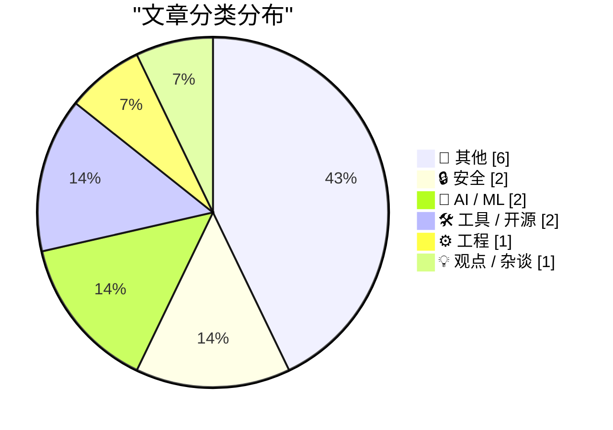
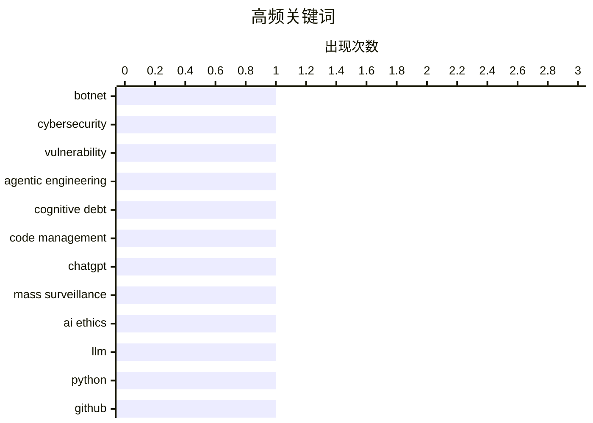

# 📰 AI 博客每日精选 — 2026-03-01

> 来自 Karpathy 推荐的 92 个顶级技术博客，AI 精选 Top 14

## 📝 今日看点

今日技术圈的主要看点集中在网络安全威胁和人工智能应用两大领域。Kimwolf机器人网络的掌控者“Dort”发起的多次网络攻击引发了广泛关注，揭示了当前网络安全面临的严峻挑战。同时，大语言模型在代码生成中的应用引发了对代码质量和安全性的讨论，显示出AI技术在工程领域的深度融合。此外，微处理器在现代技术中的关键作用也成为热点话题。

---

## 🏆 今日必读

🥇 **Kimwolf 机器人网络掌控者“Dort”是谁？**

[Who is the Kimwolf Botmaster “Dort”?](https://krebsonsecurity.com/2026/02/who-is-the-kimwolf-botmaster-dort/) — krebsonsecurity.com · 12 小时前 · 🔒 安全

> Kimwolf 是全球最大且最具破坏性的机器人网络。掌控者“Dort”发起了多次分布式拒绝服务（DDoS）攻击、泄露个人信息和电子邮件洪水攻击。文章分析了“Dort”的背景和动机，揭示了其对安全研究人员和作者的持续骚扰行为。研究人员的家中甚至被派遣了SWAT小队。

💡 **为什么值得读**: 了解“Dort”及其背后的Kimwolf机器人网络，有助于更好地防范和应对未来的网络攻击。

🏷️ botnet, cybersecurity, vulnerability

🥈 **互动解释**

[Interactive explanations](https://simonwillison.net/guides/agentic-engineering-patterns/interactive-explanations/#atom-everything) — simonwillison.net · 1 小时前 · ⚙️ 工程

> 代理编写的代码可能导致认知债务，即我们无法跟踪代码的工作原理。互动解释可以帮助减少这种债务，通过提供代码的可视化和交互式说明。这种方法特别适用于复杂的代码逻辑，使开发者能够更好地理解和维护代码。

💡 **为什么值得读**: 掌握互动解释技术，可以显著提升代码的可维护性和可理解性，从而提高开发效率。

🏷️ agentic engineering, cognitive debt, code management

🥉 **我要取消我的 ChatGPT 账户**

[That's it, I'm cancelling my ChatGPT](https://idiallo.com/byte-size/im-cancelling-my-chatgpt-openai-account?src=feed) — idiallo.com · 6 小时前 · 🤖 AI / ML

> Sam Altman 宣布加入所谓的“战争部”，使用 ChatGPT 在分类网络上进行工作，这引发了对大规模监控和武器部署的担忧。Anthropic 的 CEO 也公开拒绝与“战争部”合作。文章探讨了这些技术在军事和监控中的潜在危险。

💡 **为什么值得读**: 了解 ChatGPT 等技术在军事和监控中的应用，有助于我们更好地认识其潜在风险和伦理问题。

🏷️ ChatGPT, mass surveillance, AI ethics

---

## 📊 数据概览

| 扫描源 | 抓取文章 | 时间范围 | 精选 |
|:---:|:---:|:---:|:---:|
| 88/92 | 2369 篇 → 14 篇 | 24h | **14 篇** |

### 分类分布



### 高频关键词



<details>
<summary>📈 纯文本关键词图（终端友好）</summary>

```
botnet              │ ████████████████████ 1
cybersecurity       │ ████████████████████ 1
vulnerability       │ ████████████████████ 1
agentic engineering │ ████████████████████ 1
cognitive debt      │ ████████████████████ 1
code management     │ ████████████████████ 1
chatgpt             │ ████████████████████ 1
mass surveillance   │ ████████████████████ 1
ai ethics           │ ████████████████████ 1
llm                 │ ████████████████████ 1
```

</details>

### 🏷️ 话题标签

**botnet**(1) · **cybersecurity**(1) · **vulnerability**(1) · agentic engineering(1) · cognitive debt(1) · code management(1) · chatgpt(1) · mass surveillance(1) · ai ethics(1) · llm(1) · python(1) · github(1) · open source(1) · saas(1) · code generation(1) · microservices(1) · architecture(1) · software(1) · bash scripting(1) · file extensions(1)

---

## 📝 其他

### 1. 30 个月到 3MWh - 更多家用电池统计数据

[30 months to 3MWh - some more home battery stats](https://shkspr.mobi/blog/2026/02/30-months-to-3mwh-some-more-home-battery-stats/) — **shkspr.mobi** · 11 小时前 · ⭐ 15/30

> 文章分享了 Moixa 4.8kWh 太阳能电池在家庭中的使用情况。通过数据分析，展示了电池在一年半内的能量储存和释放情况，估计节省了约 3 兆瓦时的电能。

🏷️ home battery, solar energy

---

### 2. 2026 年 2 月 28 日阅读清单

[Reading List 02/28/26](https://www.construction-physics.com/p/reading-list-022826) — **construction-physics.com** · 10 小时前 · ⭐ 15/30

> 文章列出了与建筑物理相关的阅读清单，包括洛杉矶的许可成本、住房政策、Panasonic 停产电视、无人驾驶汽车远程操作员和地热能进展等话题。

🏷️ housing, technology, geothermal

---

### 3. Pluralistic: California can stop Larry Ellison from buying Warners (28 Feb 2026)

[Pluralistic: California can stop Larry Ellison from buying Warners (28 Feb 2026)](https://pluralistic.net/2026/02/28/golden-mean/) — **pluralistic.net** · 13 小时前 · ⭐ 12/30

> Today's links California can stop Larry Ellison from buying Warners: These are the right states' rights. Hey look at this: Delights to delectate. Object permanence: RIP Octavia Butler; "Midnighters"; 

🏷️ business, media

---

### 4. Approximation game

[Approximation game](https://lcamtuf.substack.com/p/approximation-game) — **lcamtuf.substack.com** · 21 小时前 · ⭐ 12/30

> The number 22/7 and the pigeon flock of Peter Gustav Lejeune Dirichlet.

🏷️ mathematics, approximation

---

### 5. Trump’s Enormous Gamble on Regime Change in Iran

[Trump’s Enormous Gamble on Regime Change in Iran](https://www.theatlantic.com/ideas/2026/02/trumps-iran-regime-change-attack-gamble/686190/?gift=aQyUJR7AIw1mJWdQ6Ed6yOWB4bfod1kQqCyz2RXbHaY) — **daringfireball.net** · 8 小时前 · ⭐ 11/30

> Tom Nichols, writing for The Atlantic:


  When the 2003 war with Iraq ended, U.S. Ambassador Barbara Bodine said that when American diplomats embarked on reconstruction, they ruefully joked that “the

🏷️ politics, history

---

### 6. The whole thing was a scam

[The whole thing was a scam](https://garymarcus.substack.com/p/the-whole-thing-was-scam) — **garymarcus.substack.com** · 7 小时前 · ⭐ 9/30

> The fix was in, and Dario never had a chance.

🏷️ scam, ethics

---

## 🔒 安全

### 7. Kimwolf 机器人网络掌控者“Dort”是谁？

[Who is the Kimwolf Botmaster “Dort”?](https://krebsonsecurity.com/2026/02/who-is-the-kimwolf-botmaster-dort/) — **krebsonsecurity.com** · 12 小时前 · ⭐ 27/30

> Kimwolf 是全球最大且最具破坏性的机器人网络。掌控者“Dort”发起了多次分布式拒绝服务（DDoS）攻击、泄露个人信息和电子邮件洪水攻击。文章分析了“Dort”的背景和动机，揭示了其对安全研究人员和作者的持续骚扰行为。研究人员的家中甚至被派遣了SWAT小队。

🏷️ botnet, cybersecurity, vulnerability

---

### 8. npm 数据主体访问请求

[npm Data Subject Access Request](https://nesbitt.io/2026/02/28/npm-data-subject-access-request.html) — **nesbitt.io** · 14 小时前 · ⭐ 16/30

> 文章回应了 GDPR 数据主体访问请求，详细说明了如何处理用户数据请求。通过具体案例，展示了如何在遵守隐私法规的同时，提供透明的数据访问服务。

🏷️ GDPR, data privacy, npm

---

## 🤖 AI / ML

### 9. 我要取消我的 ChatGPT 账户

[That's it, I'm cancelling my ChatGPT](https://idiallo.com/byte-size/im-cancelling-my-chatgpt-openai-account?src=feed) — **idiallo.com** · 6 小时前 · ⭐ 24/30

> Sam Altman 宣布加入所谓的“战争部”，使用 ChatGPT 在分类网络上进行工作，这引发了对大规模监控和武器部署的担忧。Anthropic 的 CEO 也公开拒绝与“战争部”合作。文章探讨了这些技术在军事和监控中的潜在危险。

🏷️ ChatGPT, mass surveillance, AI ethics

---

### 10. LLM 在 Python 源代码中的应用

[LLM Use in the Python Source Code](https://blog.miguelgrinberg.com/post/llm-use-in-the-python-source-code) — **miguelgrinberg.com** · 9 小时前 · ⭐ 24/30

> GitHub 上的 Claude 用户通过提交代码，显示了大语言模型（LLM）在 Python 源代码中的应用。这种方法可以自动生成代码，但也引发了对代码质量和安全性的担忧。文章探讨了这种技术的优缺点，以及如何在项目中识别和管理。

🏷️ LLM, Python, GitHub

---

## 🛠 工具 / 开源

### 11. 开源、SaaS 和无限代码生成后的沉默

[Open Source, SaaS, and the Silence After Unlimited Code Generation](https://worksonmymachine.ai/p/open-source-saas-and-the-silence) — **worksonmymachine.substack.com** · 9 小时前 · ⭐ 23/30

> 文章讨论了开源和 SaaS 模式在无限代码生成后的变化。随着代码生成工具的普及，开发者的反馈和参与度可能会下降，这对开源社区和 SaaS 提供商都带来了挑战。

🏷️ open source, SaaS, code generation

---

### 12. 在 Bash 脚本中处理文件扩展名

[Working with file extensions in bash scripts](https://www.johndcook.com/blog/2026/02/28/file-extensions-bash/) — **johndcook.com** · 5 小时前 · ⭐ 19/30

> 文章介绍了在 Bash 脚本中处理文件扩展名的技巧。通过示例代码，展示了如何简洁地处理文件扩展名，提升脚本的可读性和维护性。

🏷️ bash scripting, file extensions, shell scripting

---

## ⚙️ 工程

### 13. 互动解释

[Interactive explanations](https://simonwillison.net/guides/agentic-engineering-patterns/interactive-explanations/#atom-everything) — **simonwillison.net** · 1 小时前 · ⭐ 24/30

> 代理编写的代码可能导致认知债务，即我们无法跟踪代码的工作原理。互动解释可以帮助减少这种债务，通过提供代码的可视化和交互式说明。这种方法特别适用于复杂的代码逻辑，使开发者能够更好地理解和维护代码。

🏷️ agentic engineering, cognitive debt, code management

---

## 💡 观点 / 杂谈

### 14. 最重要的微处理器

[The Most Important Micros](https://www.abortretry.fail/p/the-most-important-micros) — **abortretry.fail** · 5 小时前 · ⭐ 20/30

> 文章探讨了微处理器在现代技术中的重要性，特别是它们在代表未来技术发展方向的作用。通过分析具体的微处理器案例，文章揭示了它们在各种应用中的关键作用。

🏷️ microservices, architecture, software

---

*生成于 2026-03-01 00:19 | 扫描 88 源 → 获取 2369 篇 → 精选 14 篇*
*基于 [Hacker News Popularity Contest 2025](https://refactoringenglish.com/tools/hn-popularity/) RSS 源列表，由 [Andrej Karpathy](https://x.com/karpathy) 推荐*
*由「懂点儿AI」制作，欢迎关注同名微信公众号获取更多 AI 实用技巧 💡*
